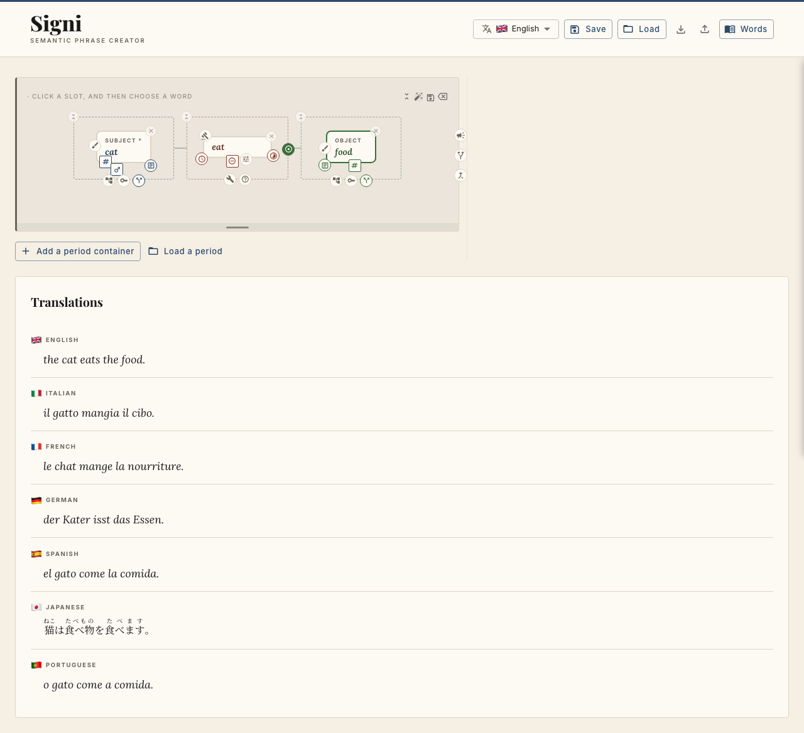

# Signi

**A rule-based, deterministic multilingual phrase builder.** You compose a phrase out of *semantic concepts* — not words — and Signi renders it grammatically in all seven supported languages at once.

There is no machine learning and no statistical model anywhere in the pipeline. Given the same phrase plan, Signi always produces the same output. Every article, agreement, conjugation, and word order is decided by hand-written grammar rules, one engine per language.

## Screenshot



*The builder canvas (top) and the same phrase rendered in all seven languages (bottom).*

## What problem it solves

Traditional translators map *surface text* from one language to another, inheriting the ambiguity of the source sentence. Signi works the other way around: you build meaning first — a subject, a verb, optional objects, modifiers, mood, aspect, and so on — and each language engine realises that meaning in its own grammar. The result is deterministic, fully controllable output where you choose exactly which concept fills each slot.

## Supported languages

English · Italian · French · German · Spanish · Japanese · Portuguese

Six are SVO (en, it, fr, de, es, pt) and one is SOV (ja, with は/を particles and masu-form verbs). The engines handle language-specific grammar such as gender agreement, article elision (French `l'`), German nominative/accusative/dative case, and Japanese particle placement.

## What you can express

- **Phrase shape** — subject + verb + optional direct/indirect object + complements + adverbs
- **Tense** — present, past, future
- **Grammatical aspect** — neutral, progressive, prospective, resultative
- **Mood** — indicative, conditional (second conditional "if… would…"), imperative (commands)
- **Modal verbs** — obligation (must), ability (can), volition (will), chainable
- **Complements** — predicative (copular), terminus (dative recipient), and the motion family (locative, direction, source, route)
- **Determiners** — definite / indefinite / bare, plus quantifiers (some, no, many, few, all)
- **Noun modifiers** — attributive nouns with their own number and agreeing adjectives
- **Proper nouns**, animacy-driven adpositions, and more

Concepts are the atoms: nouns, verbs, pronouns, adjectives, and adverbs, each with per-language lexical forms. The engine composes; it never hardcodes surface strings.

## Grammatical features in detail

Every feature below is realised by the per-language engines. Where a language lacks a synthetic form, the engine builds it periphrastically; where a form can't be derived by rule (irregulars), it comes from stored lexical data.

### Tense

Present, past, and future. Verb forms are keyed `${person}${sg|pl}_${tense}`. Past is the *simple* past (Italian passato remoto, French passé simple, Spanish indefinido; German Präteritum; invariant `past` in English). Future is synthetic where available and periphrastic otherwise — English `will` + base, German `werden` + clause-final infinitive, Japanese uses the masu form.

### Grammatical aspect

Four phases, orthogonal to tense (each available in present/past/future):

- **Neutral** — "he goes"
- **Progressive** — "he is going" (it *sta andando*, fr *est en train d'aller*, ja ～ています)
- **Prospective** — "he is about to go" (it *sta per andare*, es *a punto de*, ja ～ところです)
- **Resultative** — "he is gone" (it *è andato*, ja ～てしまいます)

Realised periphrastically with a tense-inflected auxiliary plus a non-finite main verb; participles agree with the subject where the language requires it.

### Mood

- **Indicative** — the default.
- **Conditional** — a counterfactual second conditional ("if the cat ate, the dog would run"). The "if" clause takes the imperfect subjunctive/past and the main clause the conditional; forms are derived in-engine from stored stems.
- **Imperative** — per-phrase commands ("eat the food!", "don't run!"). The subject is dropped from the surface but still selects the form: 2sg / 1pl cohortative ("let's…") / 2pl, in both affirmative and negative polarity.

### Modal verbs

Obligation (**must**), ability (**can**), and volition (**will**), modelled as concepts rather than an enum — adding a fourth modal is a data change. Modals **chain**, outermost-first: `["WILL","CAN"]` + GO → "want to be able to go" / *voglio poter andare*. Only the outermost modal is finite (carrying tense, agreement, and negation); modals also compose with aspect ("must have seen").

### Complements

Per-verb-licensed arguments beyond the direct/indirect object:

- **Predicative** — the copular complement of *become / seem / appear / be*, describing the subject with no adposition; head may be a predicate noun ("becomes a legend") or a predicate adjective agreeing with the subject ("seems happy").
- **Terminus** — the dative recipient/goal ("read the book **to the child**"), rendered with each language's dative marking.
- **Motion family** — **locative** (in/at a place), **direction** (toward a goal), **source** (away from), and **route** (via/through). Romance engines prefix an ablative adverb on source and use animacy-sensitive adpositions for direction.

### Determiners and quantifiers

Definite / indefinite / bare articles on every article-bearing slot (subject, direct object, and adposition-bearing complements), plus a full quantifier set: some, no, many, few, all. Only the definite article fuses with a preposition (it *alla*, de *zum*, fr *au*); other determiners ride after the plain preposition. German declension (mixed/strong endings, dative plural -n) is handled per case.

### Noun modifiers

An attributive noun ("sail boat", "phrase creator") is a real noun that can be **plural** and can carry **its own adjectives** that agree with it, not the head — e.g. "semantic phrase creator" → Italian *creatore di frasi semantiche*.

### Agreement, case, and language-specific rules

- **Gender/number agreement** on articles and adjectives across the Romance languages (French adjective agreement derived by rule from the masculine base).
- **German case** — nominative / accusative / dative article selection and adjective declension.
- **Article rules** — elision (French `l'`), proper-noun handling (bare in en/de/es, forced-definite in it/fr/pt), animacy-driven adpositions.
- **Japanese** — SOV order with は/を particles, masu-form verbs, te-form-based constructions, and inflected です copula with negative-polarity adverb propagation (決して…ない).
- **Negation** — polarity-correct across all engines, including English do-support vs. modal/copula direct negation, and French `ne … pas` with elision.

### Copula

A plain "he is careful" (`be`), seeded with full irregular conjugations, licensing predicative complements and integrating with tense, aspect, mood, and negation.

## Architecture

A TypeScript monorepo (npm workspaces):

| Package | Role |
| --- | --- |
| `packages/shared` | Shared TypeScript types (`Concept`, `PhrasePlan`, `LexicalEntry`, `Translation`, …) |
| `packages/engine` | Pure grammar engines, one module per language, plus the translator and mood derivation |
| `packages/backend` | Express + better-sqlite3 API (port **3001**) |
| `packages/frontend` | React + Vite + MUI phrase-builder UI (port **5173**) |

### Data model

- **`concepts`** — id (e.g. `CAT`), role (noun/verb/pronoun/adjective/adverb), description, emoji, and semantic flags (`animate`, `modal`, `proper`, …)
- **`lexical_forms`** — per concept, per language surface forms (noun base/plural/gender, verb conjugations, pronoun person/number, etc.)

Grammar lives in TypeScript code, not the database. Adding vocabulary is a data change (seed a concept + its lexical forms); adding a grammatical feature is an engine change.

### API

- `GET /api/concepts?role=<role>` — list concepts
- `POST /api/translate` — body `{ plan }` → translations for all languages
- `GET /api/payoff` — the header tagline rendered by the engine in all 7 languages
- `GET /api/languages` — each UI language's name rendered in all 7 languages

## Getting started

```bash
# install (workspaces)
npm install

# build shared → engine → backend → frontend
npm run build

# seed the SQLite database
npm run seed

# run backend (:3001) and frontend (:5173) together
npm run dev
```

Then open http://localhost:5173.

## Testing

```bash
npm run test          # unit + e2e
npm run test:unit     # vitest
npm run test:e2e      # playwright
npm run typecheck     # tsc, no emit
```

## Design principles

1. **Semantic first.** Always add a concept at the concept level, then add lexical forms per language. Never hardcode a surface form in engine logic.
2. **Deterministic.** No ML, no ambiguity — the same plan always yields the same output.
3. **Rules in code.** Grammar is hand-written TypeScript, one engine per language; the database holds only concepts and their lexical forms.
