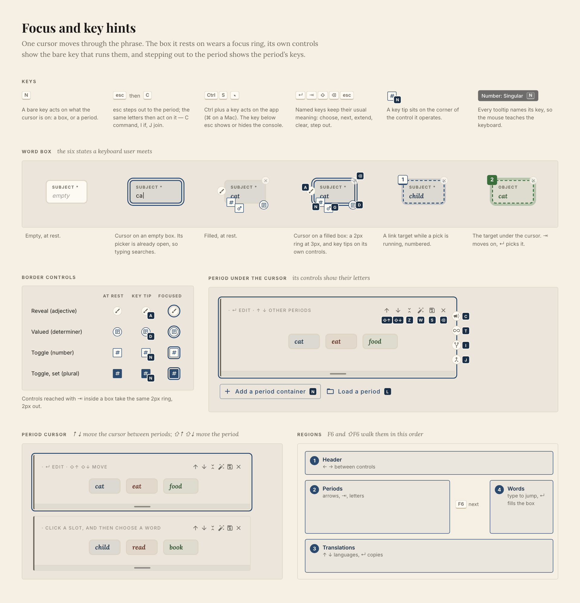
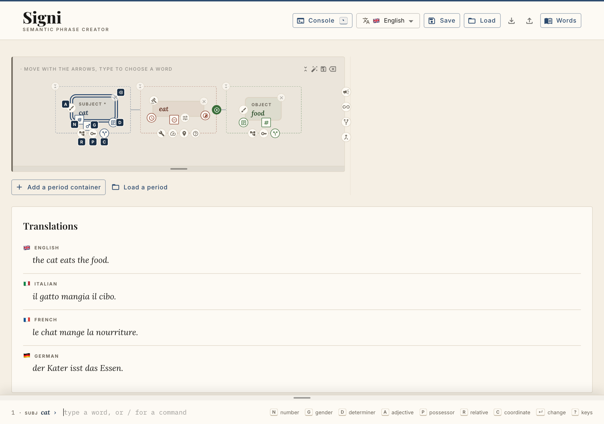
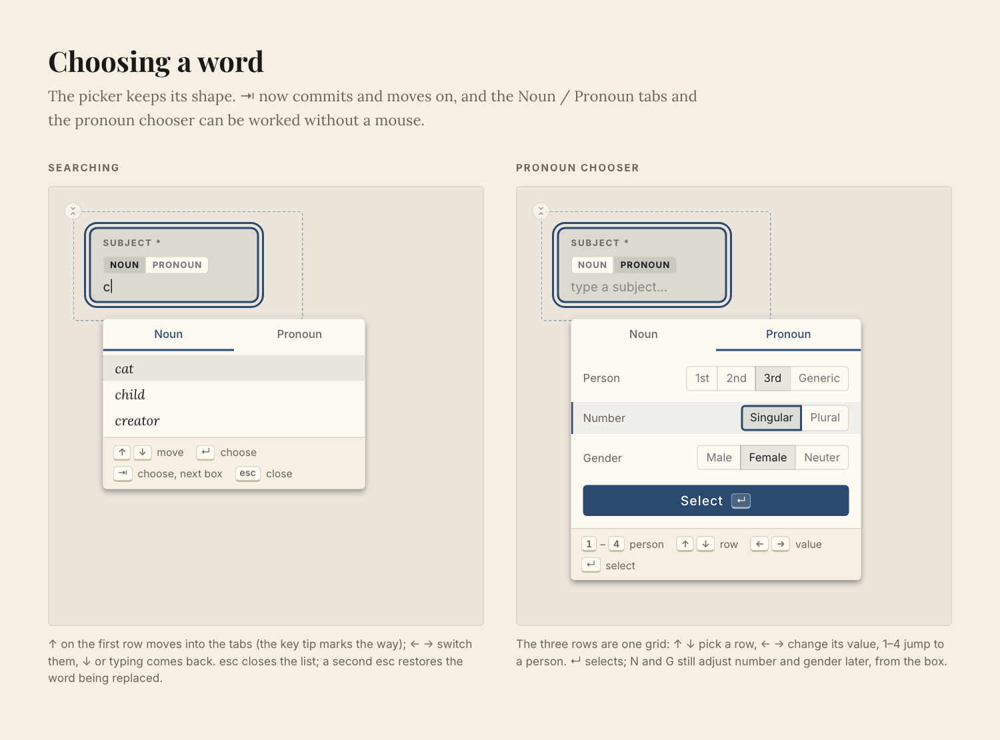
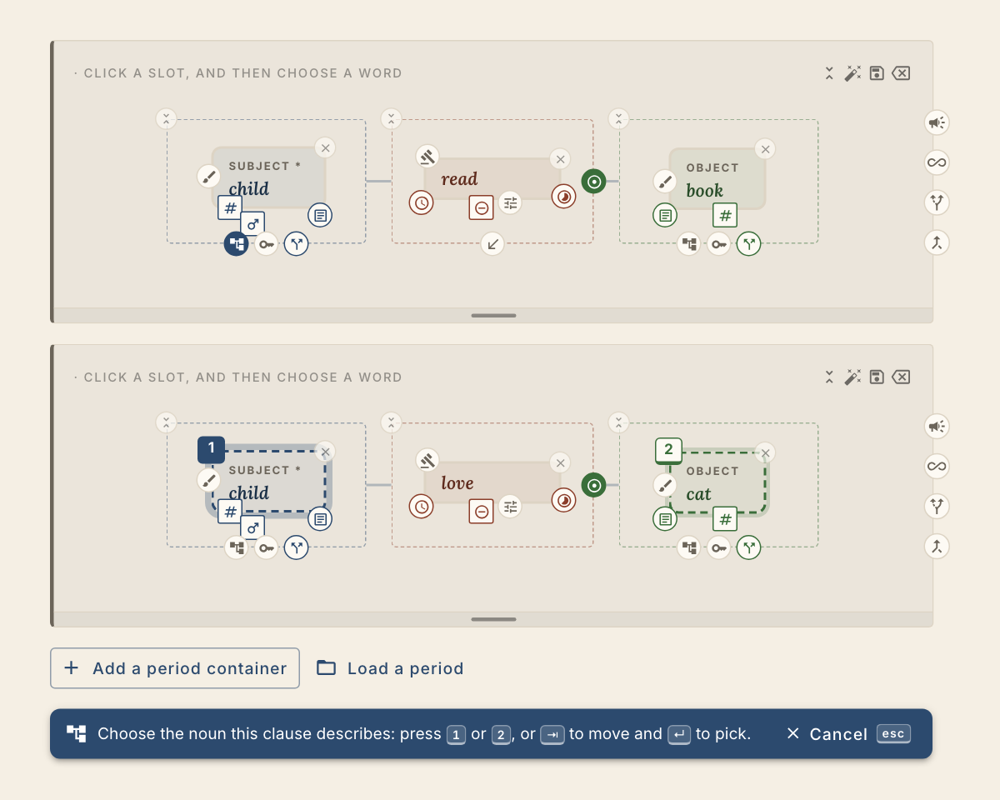
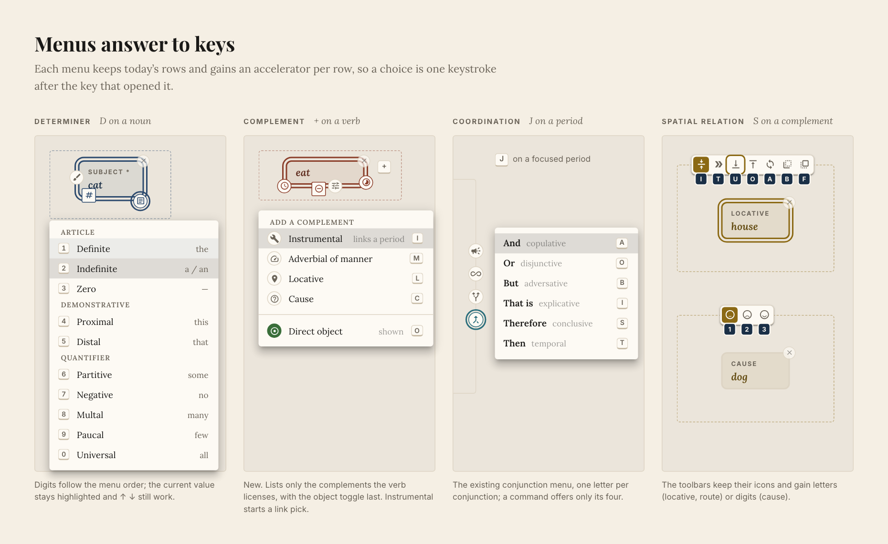
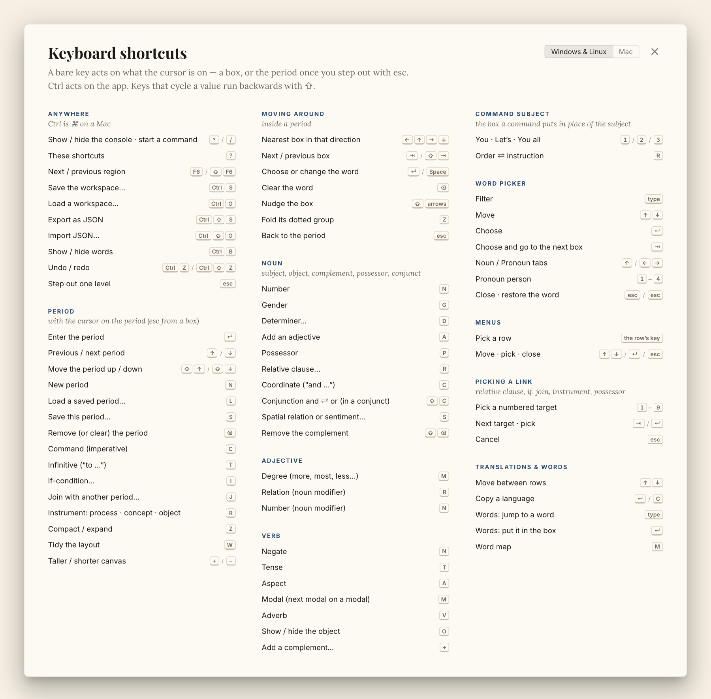
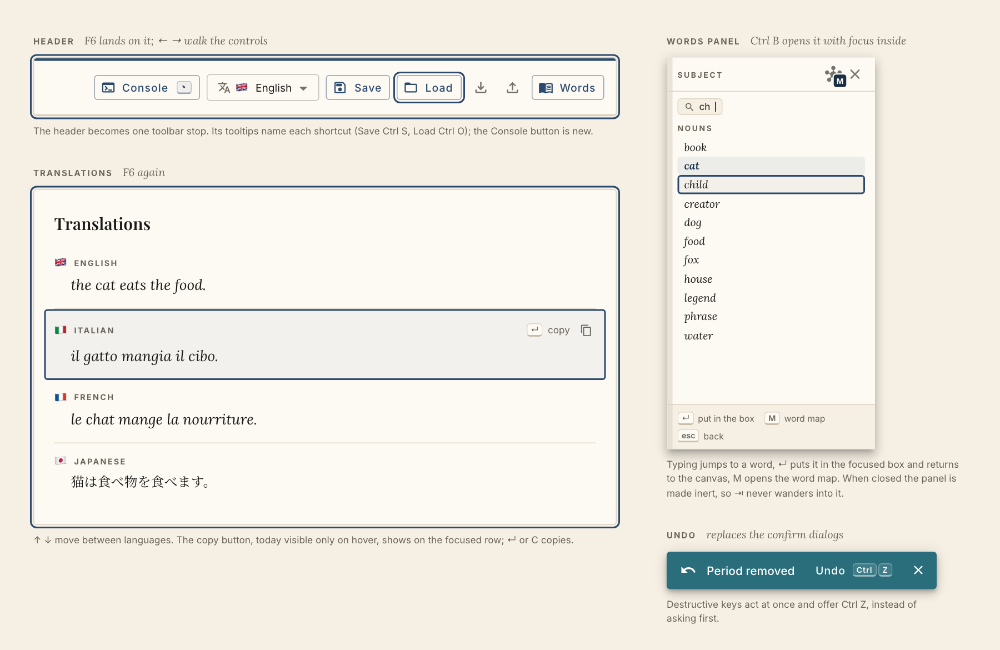

# P01. Keyboard access — every action on the canvas without a mouse

**Feature:** a complete keyboard path through the phrase builder's graphical UI: moving between
boxes and periods, every grammatical control, clause relations, panels, save/load.
**Shape:** one cursor, and keys that act on whatever the cursor is on — a box, or the period once
you step out. <kbd>Ctrl</kbd> keys act on the app. There is no Alt/⌥ layer. One keymap registry drives the
handlers, key tips, tooltips and the shortcuts sheet.
**Relation to [P02](../P02-phrase-console/README.md):** P02's phrase console is the fast, typed way to build a
phrase. This plan makes the canvas itself fully reachable, and the two share one cursor. The
command palette and hint bar once planned here are now part of the console.
**Status:** phases 1 and 2 shipped (the cursor, the box keys, the pickers and the menus); phases
3–5 planned. See
[Phases](#6-phases) for what each still covers and [Open questions](#open-questions) for what is
still undecided.
**Drawings:** [`artwork/`](artwork/) — seven images exported from page *Keyboard access (P01)* of
the [design canvas](https://claude.ai/code/artifact/7a68e65c-9f8b-44c0-b02c-8e4c4224dc8f), embedded
in [§3](#3-ui-elements-that-change) next to their ASCII sketches.

Key notation: <kbd>Ctrl</kbd> is <kbd>⌘</kbd> on a Mac; everything else is the same on every platform.
Nothing on the canvas moves or is removed; mouse users see today's UI.

---

## Why

Composing a phrase is already half-keyboard: every word picker autofocuses, filters as you type,
and takes <kbd>↑</kbd><kbd>↓</kbd><kbd>↵</kbd>; choosing a word auto-advances to the next empty
box. Everything *around* the words is mouse-only. An audit of the frontend found:

| Works by keyboard today | Mouse only today |
|---|---|
| Word pickers (↑ ↓ ↵ esc) | Changing a filled word (click the box) — [`phraseRender.tsx:423`](../../../../packages/frontend/src/components/PhraseBuilder/phraseRender.tsx#L423) ignores ↵ / Space |
| ⇥ / ← → cycle the boxes of one period | Determiner menu, tense and aspect boxes, modifier relation / number / + adj chips, degree chip — they fire on pointer-up in [`useDrag.ts:96`](../../../../packages/frontend/src/components/PhraseBuilder/hooks/useDrag.ts#L96) |
| Border controls are real buttons (reachable by DOM ⇥, but ⇥ is captured by the slot loop) | Completing a relative-clause, instrumental or possessor-reference pick (click the target) |
| Canvas resize grip (↑ ↓) | Moving boxes and groups, words-panel width, word-map pan/zoom |
| Save / load dialogs (↵, esc) | Choosing from the words panel (rows are plain `Box`es) |
| Language selector | |
| Conjunction chip on the links of a coordinated noun (↵ / Space, [`ConjunctRings.tsx`](../../../../packages/frontend/src/components/PhraseBuilder/ConjunctRings.tsx)) | |

There is one global key handler in the app (esc cancels a workspace pick,
[`useWorkspaceLinks.ts:89`](../../../../packages/frontend/src/components/PhraseBuilder/hooks/useWorkspaceLinks.ts#L89))
and no focus styling on canvas nodes (`outline: "none"` in
[`useDrag.ts:106`](../../../../packages/frontend/src/components/PhraseBuilder/hooks/useDrag.ts#L106)).

## Principles

1. **One cursor.** `PhraseBuilder`'s `activeSlot` already *is* a cursor (focusing a box sets it).
   It grows into a workspace-wide cursor that rests on a period, a box, or a control — and it is the
   same cursor the console's context follows (P02).
2. **The cursor's level decides what a key means — not a modifier.**
   - on a **box**, a bare key acts on that box (<kbd>N</kbd> number, <kbd>T</kbd> tense);
   - <kbd>esc</kbd> steps out to the **period**, where bare keys act on the period (<kbd>C</kbd> command,
     <kbd>I</kbd> if-condition, <kbd>J</kbd> join);
   - <kbd>Ctrl</kbd> + key acts on the **app** (<kbd>Ctrl</kbd><kbd>S</kbd> save, <kbd>Ctrl</kbd><kbd>Z</kbd> undo);
   - <kbd>&#96;</kbd> (the key below <kbd>esc</kbd>) shows or hides the console (P02) from anywhere.
   Modifier layers behave differently across macOS, Windows, Linux and keyboard layouts; levels don't.
3. **Empty box types, filled box commands.** On an empty box the picker is already open, so
   letters search (as today). On a filled box letters are commands and <kbd>↵</kbd> changes the word.
4. **Parity, not new behaviour.** Every key calls the handler the click calls
   (`handleCycleTense`, `handleToggleNumber`, `binding.relative.onStartLink`, …). No grammar path is
   keyboard-only.
5. **One source of truth.** A declarative keymap drives the key handling, key tips, tooltip keycaps,
   the hint line and the ? sheet — they cannot drift apart.
6. **Accelerators for the frequent, reachability for everything.** Common actions get a key; every
   control is also a focusable button; every action also has a console command.
7. **Visible.** A focus ring, key tips on the controls under the cursor, and a hint line that says
   what the keys do *here*.

---

## 1. How it feels

A session that never touches the mouse or the console. It starts where the app starts: the cursor
on the empty Subject box of the first period.

| Keys | What happens |
|---|---|
| <kbd>c</kbd> <kbd>a</kbd> <kbd>↵</kbd> | Subject = *cat*. The cursor auto-advances to the Verb (existing behaviour). |
| <kbd>e</kbd> <kbd>a</kbd> <kbd>↵</kbd> | Verb = *eat*; cursor to the Object. |
| <kbd>f</kbd> <kbd>o</kbd> <kbd>↵</kbd> | Object = *food*; the cursor stays on it (nothing left to fill). |
| <kbd>←</kbd> <kbd>←</kbd> <kbd>N</kbd> | Arrows walk to *cat* (nearest box to the left); <kbd>N</kbd> makes it plural. |
| <kbd>→</kbd> <kbd>T</kbd> | On *eat*, <kbd>T</kbd> cycles the tense to past. Translations update. |
| <kbd>esc</kbd> <kbd>N</kbd> | esc lifts the cursor to the period; <kbd>N</kbd> adds a new period, with the cursor on its empty Subject. |
| <kbd>d</kbd> <kbd>o</kbd> <kbd>↵</kbd> <kbd>s</kbd> <kbd>e</kbd> <kbd>↵</kbd> <kbd>c</kbd> <kbd>a</kbd> <kbd>↵</kbd> | Period 2: *dog · see · cat*. |
| <kbd>esc</kbd> <kbd>↑</kbd> <kbd>↵</kbd> | Up to period 1, and back into it (to *cat*, the last box). |
| <kbd>R</kbd> | Starts the relative-clause pick: the nouns of period 2 are numbered *1 dog*, *2 cat*. |
| <kbd>2</kbd> | The link is made; period 2 now describes *cat*. |
| <kbd>Ctrl</kbd><kbd>S</kbd> … <kbd>↵</kbd> | Save dialog, type a name, ↵. |

The same session in the console is P02 §1.

## 2. Focus model

### Levels

```
 App ─────── Period ─────────── Box ─────────── Control
 Ctrl keys   bare keys          bare keys       Space / ↵
             ↑ ↓ other periods  arrows · ⇥      (⇥ inside a box)
             ↵ enter            esc → period
```

- **Period** (card under the cursor): <kbd>↑</kbd><kbd>↓</kbd> move between periods, <kbd>↵</kbd> enters
  the period at its last focused box (the Subject the first time), letters run period actions.
- **Box**: arrows move spatially, <kbd>⇥</kbd> in reading order, letters act on the box, <kbd>esc</kbd>
  returns to the period.
- **Control**: rarely needed; controls are buttons that <kbd>⇥</kbd> can reach once inside the box's
  control ring (open question 3); <kbd>Space</kbd>/<kbd>↵</kbd> activate.
- **Popups** (picker, menu, dialog) trap focus; <kbd>esc</kbd> closes and gives focus back to what
  opened them.

<kbd>esc</kbd> always steps out exactly one level: popup → box → period → (nothing).

*Phase 1:* there is no period level yet, so <kbd>esc</kbd> on a box lets the box go rather than
landing on its period, and one <kbd>esc</kbd> inside the word picker both closes its list (the
picker's own handler) and steps back onto the box. The shared picker keys of phase 2 make those
the two distinct steps §4.5 describes.

### Arrows are spatial

Boxes are freely placed on the canvas, so arrow keys use geometry, not DOM order: from the focused
box's centre, pick the box whose centre lies inside a 90° cone in that direction, minimising
`distance + 2 × perpendicular offset`. The rects are already measured (`slotEls`, `boxSizes`).
At the canvas edge, <kbd>↑</kbd>/<kbd>↓</kbd> cross into the neighbouring period. Conjunct and owner
rings sit on the canvas itself, so they are reached like any other box.

### ⇥ is reading order, across the whole document

<kbd>⇥</kbd> walks subject → its adjectives → its owner → its conjuncts (each followed by its owner) →
verb → modals / adverbs → object → complements → the next period → *Add a period* → translations. It no longer loops
inside one period (today's loop in `SlotNode` traps focus), so the page keeps a normal tab order.

### Regions

<kbd>F6</kbd> / <kbd>⇧</kbd><kbd>F6</kbd> jump between landmarks, each remembering its last focus:
**Header** (one toolbar stop; <kbd>←</kbd><kbd>→</kbd> between controls) → **Periods** →
**Translations** (<kbd>↑</kbd><kbd>↓</kbd> between languages) → **Words** (when open) → **Console** (when shown).

### Input modality

A `data-input="keyboard" | "pointer"` attribute on `<body>`, flipped by the last `keydown` /
`pointerdown`, decides whether key tips and the keyboard caption show. Mouse users see today's UI
unchanged, apart from keycaps in tooltips and the Console button.

---

## 3. UI elements that change

Each subsection shows the drawing from [`artwork/`](artwork/) first and a text sketch after it. The editable originals are on the [design canvas](https://claude.ai/code/artifact/7a68e65c-9f8b-44c0-b02c-8e4c4224dc8f), page *Keyboard access (P01)*.

### 3.1 Word box under the cursor — *artboards "Keyboard mode, at rest", "Focus and key hints"*



```
   ┌ ─ ─ ─ ─ ─ ─ ─ ─ ─ ─ ─ ─ ─ ─ ┐      dotted Subject group (unchanged)
                          [⌫]
   │   [A] ╔═══════════════╗     │     ═══  focus ring: 2px slot colour, 3px outside the box
      (✎)  ║ SUBJECT *     ║           [N]  key tip: 15px ink badge (#1a2f46) on the corner
   │       ║ cat           ║     │          of the control it operates
           ╚══[#]═══[♂]═══(≡)╝
   │    [N]   [G]      [D]       │
    ─ ─ ─ ─(⑂)─(⚿)─(Y)─ ─ ─ ─ ─ ─
           [R]  [P]  [C]
```

- Focus ring = `outline: 2px solid <slot>.main; outline-offset: 3px`, so it never shifts layout and
  stays distinct from the dashed *pick-target* and *preview* styles.
- Key tips appear only on the controls **under the cursor**, only in keyboard modality.
- A caption variant for keyboard modality: `· MOVE WITH THE ARROWS, TYPE TO CHOOSE A WORD`.
- Tooltips everywhere gain a keycap: `Number: Singular  [N]`.

### 3.2 Hint line — *artboard "Keyboard mode, at rest"*



While the console (P02) is shown and focus is on the canvas, its prompt line doubles as the hint line:
its right side lists the keys for whatever the cursor is on, read from the keymap. When the console is
hidden (<kbd>&#96;</kbd>), key tips and tooltips still teach the keys. Until P02 ships, phase 1 renders the
same strip on its own.

```
─────────────────────────────── grip ───────────────────────────────────────────────────────────
 1 · SUBJ cat ›  ▏type a word, or / for a command     [N] number [G] gender [D] determiner [A] adjective
                                                      [P] possessor [R] relative [C] coordinate [↵] change [?] keys
```

### 3.3 Header — *artboards "Keyboard mode, at rest", "Header, translations, words, undo"*

```
Signi                        [▣ Console `] [文A 🇬🇧 English ▾] [Save] [Load]  ⤓  ⤒  [Words]
SEMANTIC PHRASE CREATOR       └ new
```

One new outlined button shows or hides the console and carries the <kbd>&#96;</kbd> keycap. The cluster becomes a single `role="toolbar"` stop.

### 3.4 Period under the cursor — *artboard "Focus and key hints"*

```
 ╔═════════════════════════════════════════════════════╗
 ║ · ↵ EDIT · ↑ ↓ OTHER PERIODS         ↑   ↓   ⇲  ✦  💾  ✕ ║ (📣) [C]
 ║                                    [⇧↑][⇧↓][Z][W][S][⌫]║ (∞)  [T]
 ║        cat     eat     food                            ║ (⑂)  [I]
 ║                                                        ║ (⤙)  [J]
 ╚═════════════════════════════════════════════════════╝
 [+ Add a period container [N]]   [Load a period [L]]
```

With the cursor on a period (a 2px primary ring around the card), every period control shows the
letter it answers to.

### 3.5 Word picker — *artboard "Choosing a word"*



```
 ╔═══════════════════╗
 ║ SUBJECT *         ║
 ║ [NOUN|PRONOUN]    ║
 ║ c▏                ║
 ╚═══════════════════╝
   ┌────────────────────────────┐
   │   Noun      │   Pronoun    │  ← ↑ from the first row, then ← →
   │─────────────               │
   │ cat                        │  (highlighted)
   │ child                      │
   │ creator                    │
   │────────────────────────────│  new footer
   │ ↑↓ move  ↵ choose  ⇥ choose, next box  esc close │
   └────────────────────────────┘
```

- <kbd>⇥</kbd> commits the highlighted word and moves to the next box; with an empty query it just moves.
- <kbd>esc</kbd> closes the list; a second <kbd>esc</kbd> cancels a re-pick and restores the word.
- Pronoun chooser: the Person / Number / Gender rows form a grid (<kbd>↑</kbd><kbd>↓</kbd> row,
  <kbd>←</kbd><kbd>→</kbd> value, <kbd>1</kbd>–<kbd>4</kbd> person, <kbd>↵</kbd> select).

### 3.6 Picking a link — *artboard "Picking a link"*



```
 ┃ child ─── read ─── book                      period 1: (⑂) on child is the source (solid)
 ┃
 ┃ ┏1┓- - - - - ┐          ┏2┓- - - - ┐          period 2: eligible nouns, numbered
 ┃ ╏ SUBJECT *  ╏ ── love ─ ╏ OBJECT   ╏          1 = under the cursor (filled badge, wider halo)
 ┃ ╏ child      ╏           ╏ cat      ╏
 ┃  - - - - - - -            - - - - - -
╭────────────────────────────────────────────────────────────────────────────╮
│ ⑂ Choose the noun this clause describes: press [1] or [2], or [⇥] to move and [↵] to pick.  ✕ Cancel [esc] │
╰────────────────────────────────────────────────────────────────────────────╯
```

Same for the period-level picks (if-condition, join, instrument): the eligible *period cards* get
the numbers. The "point to the owner" pick (an opened owner lights up the nouns it could point to)
uses the same badges and gains <kbd>esc</kbd> (it has none today). The console shows the same numbers inline (P02 §2).

### 3.7 Menus with accelerators — *artboard "Menus with accelerators"*



```
 Determiner (D)             Add a complement (+) — new     Coordination (J on a period)
┌──────────────────────┐   ┌───────────────────────────┐   ┌────────────────────────┐
│ ARTICLE              │   │ ADD A COMPLEMENT          │   │ And    copulative  [A] │
│ [1] Definite     the │   │ (🔧) Instrumental  …   [I] │   │ Or     disjunctive [O] │
│ [2] Indefinite a / an│   │ (⏱) Adverbial of manner[M] │   │ But    adversative [B] │
│ [3] Zero           — │   │ (📍) Locative          [L] │   │ That is explicative[I] │
│ DEMONSTRATIVE        │   │ (?) Cause              [C] │   │ Therefore conclusive[S]│
│ [4] Proximal    this │   │ ───────────────────────── │   │ Then   temporal    [T] │
│ [5] Distal      that │   │ (◉) Direct object shown[O] │   └────────────────────────┘
│ QUANTIFIER           │   └───────────────────────────┘
│ [6] Partitive   some │    Spatial relation (S): the existing toolbar gains letters
│ [7] Negative      no │    [I]in [T]through [U]under [O]over [A]around [B]behind [F]in front
│ [8] Multal      many │    Sentiment (S on cause): [1] neutral [2] negative [3] positive
│ [9] Paucal       few │
│ [0] Universal    all │
└──────────────────────┘
```

The complement menu is the only new menu: it lists exactly the complements the verb licenses
(today's complement toggle row) plus the object show/hide toggle.

### 3.8 Shortcuts sheet (?) — *artboard "Shortcuts sheet"*



A dialog rendering §4 from the keymap, three columns, with a **Windows & Linux / Mac** switch that
re-renders the <kbd>Ctrl</kbd> keycaps. The console's commands have their own reference (`/help`, P02).

### 3.9 Translations, words panel, undo — *artboard "Header, translations, words, undo"*



```
 TRANSLATIONS (F6)                              WORDS (Ctrl B)        [⌖ M] [✕]
 🇬🇧 ENGLISH                                    ┌─────────────────────────────┐
    the cat eats the food.                       │ SUBJECT                     │
┏━━━━━━━━━━━━━━━━━━━━━━━━━━━━━━━━━━━━━━━━━━┓   │ [🔍 ch▏]                     │
┃ 🇮🇹 ITALIAN                   [↵] copy ⧉ ┃   │ NOUNS                       │
┃    il gatto mangia il cibo.              ┃   │  book                       │
┗━━━━━━━━━━━━━━━━━━━━━━━━━━━━━━━━━━━━━━━━━━┛   │  cat          (selected)    │
 🇫🇷 FRENCH                                     │ ┃child┃       (focused)     │
    le chat mange la nourriture.                 │  creator …                  │
                                                 │ ↵ put in the box  M word map │
  ╭────────────────────────────────╮             │ esc back                    │
  │ ↶ Period removed  Undo [Ctrl][Z] ✕│             └─────────────────────────────┘
  ╰────────────────────────────────╯
```

- The focused translation row shows its copy button (today `opacity: 0` unless hovered,
  [`TranslationPanel.tsx:156`](../../../../packages/frontend/src/components/TranslationPanel.tsx#L156)).
- The words panel: typing jumps to a word, <kbd>↵</kbd> fills the focused box and returns to the
  canvas, <kbd>M</kbd> opens the word map. When closed it becomes `inert` (today it only gets
  `pointerEvents: none`, [`PhraseSidebar.tsx:93`](../../../../packages/frontend/src/components/PhraseBuilder/PhraseSidebar.tsx#L93), so ⇥ can land inside it).
- The undo toast reuses the existing filled `Alert` snackbar, in `info`.

---

## 4. Keyboard shortcuts

<kbd>Ctrl</kbd> is <kbd>⌘</kbd> on a Mac. Keys that **cycle** a value run backwards with <kbd>⇧</kbd>
(<kbd>⇧</kbd><kbd>T</kbd>, <kbd>⇧</kbd><kbd>A</kbd>, <kbd>⇧</kbd><kbd>G</kbd>, <kbd>⇧</kbd><kbd>M</kbd>, <kbd>⇧</kbd><kbd>R</kbd>).

### 4.1 Anywhere — app

| Keys | Action | Today's control |
|---|---|---|
| <kbd>&#96;</kbd> · <kbd>/</kbd> | Show / hide the console (the key below <kbd>esc</kbd>) · <kbd>/</kbd> shows it with a command started | new (P02) |
| <kbd>?</kbd> | Shortcuts sheet | new |
| <kbd>F6</kbd> / <kbd>⇧</kbd><kbd>F6</kbd> | Next / previous region | new |
| <kbd>Ctrl</kbd><kbd>S</kbd> | Save the workspace… | header *Save* |
| <kbd>Ctrl</kbd><kbd>O</kbd> | Load a workspace… | header *Load* |
| <kbd>Ctrl</kbd><kbd>⇧</kbd><kbd>S</kbd> | Export as JSON | header ⤓ |
| <kbd>Ctrl</kbd><kbd>⇧</kbd><kbd>O</kbd> | Import JSON… | header ⤒ |
| <kbd>Ctrl</kbd><kbd>B</kbd> | Show / hide the words panel (focus moves in) | header *Words* |
| <kbd>Ctrl</kbd><kbd>Z</kbd> / <kbd>Ctrl</kbd><kbd>⇧</kbd><kbd>Z</kbd> | Undo / redo | new (phase 5) |
| <kbd>esc</kbd> | Step out one level | — |

### 4.2 Period — bare keys, with the cursor on the period

| Keys | Action | Today's control |
|---|---|---|
| <kbd>↵</kbd> | Enter the period (last focused box) | — |
| <kbd>↑</kbd> / <kbd>↓</kbd> | Previous / next period | — |
| <kbd>⇧</kbd><kbd>↑</kbd> / <kbd>⇧</kbd><kbd>↓</kbd> | Move the period up / down | header ↑ ↓ |
| <kbd>N</kbd> | New period (cursor on its Subject) | *Add a period container* |
| <kbd>L</kbd> | Load a saved period… | *Load a period* |
| <kbd>S</kbd> | Save this period… | header 💾 |
| <kbd>⌫</kbd> | Remove the period (clear it if it is the only one) | header ✕ / ⌫ |
| <kbd>C</kbd> | Command (imperative) on / off | border 📣 |
| <kbd>T</kbd> | Infinitive ("to …") on / off | border ∞ |
| <kbd>I</kbd> | If-condition: pick the IF period / remove it | border ⑂ (AltRoute) |
| <kbd>J</kbd> | Join with another period: conjunction menu, then pick / remove | border ⤙ (CallMerge) |
| <kbd>R</kbd> | Instrument level: process → concept → object (instrument periods) | header level chips |
| <kbd>Z</kbd> | Compact / expand | header ⇲ |
| <kbd>W</kbd> | Tidy the layout | header ✦ (AutoFixHigh) |
| <kbd>+</kbd> / <kbd>−</kbd> | Taller / shorter canvas (16px, like the grip) | resize grip |

### 4.3 Box — moving around

| Keys | Action |
|---|---|
| <kbd>←</kbd><kbd>↑</kbd><kbd>→</kbd><kbd>↓</kbd> | Nearest box in that direction (↑ ↓ cross into the neighbouring period or panel) |
| <kbd>⇥</kbd> / <kbd>⇧</kbd><kbd>⇥</kbd> | Next / previous box in reading order |
| <kbd>↵</kbd> · <kbd>Space</kbd> | Choose or change the word |
| <kbd>⌫</kbd> | Clear the word |
| <kbd>⇧</kbd> + arrows | Nudge the box 8px |
| <kbd>Z</kbd> | Fold / unfold its dotted group |
| <kbd>esc</kbd> | Up to the period |

### 4.4 Box — grammar (bare keys on a filled box)

**Noun** — subject, object, complement, possessor head, conjunct

| Key | Action | Today's control |
|---|---|---|
| <kbd>N</kbd> | Number singular ⇄ plural | # |
| <kbd>G</kbd> | Gender masc → fem → neut | ♂ ♀ ⚧ |
| <kbd>D</kbd> | Determiner menu (then <kbd>1</kbd>–<kbd>0</kbd>) | determiner box / ≡ |
| <kbd>A</kbd> | Add an adjective to the nearest noun (next in the chain, max 3) | ✎ |
| <kbd>P</kbd> | Possessor: reveal the panel, cursor into its head | ⚿ |
| <kbd>R</kbd> | Relative clause: start the pick / remove the link | ⑂ (AccountTree) |
| <kbd>C</kbd> | Coordinate: add an "and …" conjunct, cursor into it | Y (CallSplit) |
| <kbd>⇧</kbd><kbd>C</kbd> | Conjunction and ⇄ or (on a coordinated noun or one of its conjuncts) | conjunction chip |
| <kbd>S</kbd> | Spatial relation (locative, route) or sentiment (cause) | selector toolbar |
| <kbd>⇧</kbd><kbd>⌫</kbd> | Remove the complement | group ✕ |

**Adjective**

| Key | Action | Today's control |
|---|---|---|
| <kbd>A</kbd> | Next adjective; on a noun modifier, the modifier's own adjective | ✎ / *+ adj* chip |
| <kbd>M</kbd> | Degree: positive → more → most → less → least → equally | degree chip |
| <kbd>R</kbd> | Relation (noun modifier): feature → purpose → material | relation chip |
| <kbd>N</kbd> | Number (noun modifier) | SG/PL chip |

**Verb**

| Key | Action | Today's control |
|---|---|---|
| <kbd>N</kbd> | Negate (positive ⇄ negative) | ⊖ |
| <kbd>T</kbd> | Tense: present → past → future | tense box |
| <kbd>A</kbd> | Aspect: neutral → progressive → prospective → resultative | aspect box |
| <kbd>M</kbd> | Modal (on a modal box: the next modal) | ⚖ (Gavel) |
| <kbd>V</kbd> | Adverb (on a modal box: that modal's adverb) | ⚟ (Tune) |
| <kbd>O</kbd> | Show / hide the direct object | ◉ (Adjust) |
| <kbd>+</kbd> | Add a complement… (menu; <kbd>=</kbd> also works) | complement toggle row |

**Command subject** (the box a command puts in place of the subject)

| Key | Action |
|---|---|
| <kbd>1</kbd> <kbd>2</kbd> <kbd>3</kbd> | You · Let's · You all |
| <kbd>R</kbd> | Register: order ⇄ instruction |

### 4.5 Popups

| Where | Keys |
|---|---|
| Word picker | type to filter · <kbd>↑</kbd><kbd>↓</kbd> move · <kbd>↵</kbd> choose · <kbd>⇥</kbd> choose and go to the next box · <kbd>↑</kbd> on the first row → tabs, <kbd>←</kbd><kbd>→</kbd> switch · <kbd>esc</kbd> close, <kbd>esc</kbd> again restores the word |
| Pronoun chooser | <kbd>↑</kbd><kbd>↓</kbd> row · <kbd>←</kbd><kbd>→</kbd> value · <kbd>1</kbd>–<kbd>4</kbd> person · <kbd>↵</kbd> select |
| Menus | the row's key picks it · <kbd>↑</kbd><kbd>↓</kbd> · <kbd>↵</kbd> · <kbd>esc</kbd> |
| Link pick | <kbd>1</kbd>–<kbd>9</kbd> pick a numbered target · <kbd>⇥</kbd> next target · <kbd>↵</kbd> pick · <kbd>esc</kbd> cancel |
| Load dialogs | <kbd>↑</kbd><kbd>↓</kbd> · <kbd>↵</kbd> load · <kbd>⌫</kbd> delete (with undo) · <kbd>esc</kbd> |
| Word map | arrows pan · <kbd>+</kbd><kbd>−</kbd> zoom · <kbd>0</kbd> reset · <kbd>⇥</kbd> cycle words (applies the hover highlight) · <kbd>esc</kbd> close |

### 4.6 Regions

| Where | Keys |
|---|---|
| Header | <kbd>←</kbd><kbd>→</kbd> between controls · <kbd>↵</kbd>/<kbd>Space</kbd> activate |
| Translations | <kbd>↑</kbd><kbd>↓</kbd> languages · <kbd>↵</kbd> or <kbd>C</kbd> copy |
| Words panel | type to jump · <kbd>↑</kbd><kbd>↓</kbd> · <kbd>↵</kbd> put in the box · <kbd>M</kbd> word map · <kbd>←</kbd><kbd>→</kbd> on the edge handle resize · <kbd>esc</kbd> back to the canvas |

### 4.7 Why these keys

- **No Alt/⌥ layer.** Alt means different things on each OS (a character composer on macOS,
  browser menus on Windows and Firefox) and shifts with keyboard layouts. Stepping out with
  <kbd>esc</kbd> costs one keystroke and works the same everywhere.
- **Letters are mnemonic within their level** and repeat meaning where the idea repeats:
  <kbd>N</kbd> is number on nouns and *not* on verbs (verbs have no number); <kbd>A</kbd> adds an
  adjective to nouns and is aspect on verbs (verbs take no adjective). The hint line always shows
  the local meaning.
- **<kbd>&#96;</kbd> is matched by position**, not by character (P02 §2.1), so the console toggle exists on
  layouts with no backtick key, such as Italian.
- **Digits are for choices in a list** (determiners, sentiments, pick targets, pronoun person,
  command addressee) — layout-independent and never part of a word search.
- **<kbd>Ctrl</kbd> is only used where apps conventionally use it** (save, open, undo). <kbd>Ctrl</kbd><kbd>N</kbd>/<kbd>T</kbd>/<kbd>W</kbd>/<kbd>L</kbd>/<kbd>1</kbd>–<kbd>9</kbd>
  belong to the browser and are never bound.

---

## 5. Architecture

### 5.1 New module — `packages/frontend/src/keyboard/`

| File | Role |
|---|---|
| `keymap.ts` | The declarative command list (below). Single source for handlers, key tips, hint line, sheet. |
| `KeyboardProvider.tsx` | One `keydown` listener on `window`; resolves the scope from the cursor, matches, runs. Tracks input modality. |
| `matchKey.ts` | Platform-aware matching and keycap labels (Ctrl / ⌘). |
| `scope.ts` | `data-kb-scope` resolution from `document.activeElement` up to the workspace. |
| `spatialNav.ts` | The cone-and-distance search over measured box rects. Pure, unit-tested. |
| `Keycap.tsx`, `KeyTip.tsx` | The two atoms (paper keycap; 15px ink badge). |
| `focusRing.ts`, `activate.ts` | The cursor's ring, and what makes a canvas box that is not a word (tense, aspect, determiner) answer to ↵ and Space. |
| `boxes.ts` | The word boxes of the page as one list, which both the cursor and the open picker walk. |
| `useMenuKeys.ts` | The accelerator per row, for every menu and for an armed relation toolbar. |
| `HintLine.tsx` | The keys for the cursor's scope; later rendered inside the collapsed console (P02). |
| `ShortcutSheet.tsx` | ? dialog; renders §4 from `keymap`, Windows & Linux / Mac switch. |

```ts
// keymap.ts
export type Scope =
  | "app" | "period"
  // `box` is every word box alike — moving about, choosing a word, clearing it — and a box is
  // looked up in its own grammar first, then in it: ["box:noun", "box"]. That split is what lets
  // N be the number on a noun and the negation on a verb with no modifier to tell them apart.
  | "box" | "box:noun" | "box:adjective" | "box:verb" | "box:mood"
  | "picker" | "menu" | "pick" | "translations" | "words";

export interface Command {
  id: string;                    // "noun.number"
  scope: Scope;
  keys: string[];                // ["N"], ["Shift+ArrowUp"], ["Mod+S"]; Mod = Ctrl, ⌘ on a Mac
  label: string;                 // English: the fallback, and the name of anything not yet seeded
  labelKey?: UiStringKey;        // rendered name, where the action's words are in the catalogue
  when?: (ctx: KeyContext) => boolean;   // e.g. satellite available, verb licenses complements
  run: (ctx: KeyContext) => void | boolean;   // false declines the keystroke, leaving it to the browser
  hint?: boolean;                // show in the hint line
  satellite?: RegExp;            // the controls it drives, which wear its key as a tip
}
```

`KeyContext` is assembled from what `PhraseBuilder` already computes — `selection`, `activeSlot`,
`satellites` (with `available`), the handler bag it passes as `PhraseRenderContext`, and the
container's `WorkspaceBinding`. `when` reuses `Satellite.available`, so a key exists exactly when its
button does.

Each builder publishes that assembly as a *scope* — a stable object whose builder function is
replaced on every render — and provides it to its own subtree, so a command always runs against the
current selection rather than the one in hand when the cursor arrived, and a hosted ring's boxes (a
conjunct's, an owner's) answer to the builder that draws them rather than to the period's. A box
takes the cursor while it holds DOM focus; the provider needs nothing but `document.activeElement`
to know what a key means.

### 5.2 Matching rules

- **Bare keys match `event.key`** (case-insensitive), so mnemonics follow the user's layout
  (AZERTY's <kbd>A</kbd> is the key labelled A). Ignored while the target is editable, except inside
  the picker's own handler.
- **`Mod` chords** use `metaKey` on a Mac and `ctrlKey` elsewhere; bound only while the app has focus.
- A registry test fails the build if two commands in the same scope share a key.

### 5.3 Integration points

| File | Change |
|---|---|
| [`PhraseBuilder.tsx`](../../../../packages/frontend/src/components/PhraseBuilder/PhraseBuilder.tsx) | Register this container's `KeyContext` with the provider; `activeSlot` (line 188) becomes the cursor; remember the last focused box for ↵-from-period. Expose "open determiner / specifier menu for slot" setters. |
| [`phraseRender.tsx`](../../../../packages/frontend/src/components/PhraseBuilder/phraseRender.tsx) | `SlotNode` (lines 415–440): replace the Tab/←→ loop with `data-kb-scope`, ↵/Space → `handleEditSlot`, key tips for its own controls; footer chips (relation, number, + adj, degree) become buttons. |
| [`hooks/useDrag.ts`](../../../../packages/frontend/src/components/PhraseBuilder/hooks/useDrag.ts) | Drop `outline: "none"`; add a `:focus-visible` ring; expose `nudge(key, dx, dy)` for ⇧+arrows. |
| [`NounPhraseBuilder.tsx`](../../../../packages/frontend/src/components/PhraseBuilder/NounPhraseBuilder.tsx) | `DeterminerMenu` opens from a key (anchor = determiner box or satellite); digit accelerators on rows. |
| [`VerbPhraseBuilder.tsx`](../../../../packages/frontend/src/components/PhraseBuilder/VerbPhraseBuilder.tsx) | Tense / aspect boxes keyboard-activatable; new *Add a complement* menu built from `complementToggleIcons` + `directObjectToggle`; specifier / sentiment toolbars get letter / digit accelerators. |
| [`PeriodContainer/`](../../../../packages/frontend/src/components/PhraseBuilder/PeriodContainer/) | `data-kb-scope="period"`, period cursor ring and key tips (`PeriodContainer.tsx`), conjunction-menu accelerators (`ConjunctionMenu.tsx`), numbered badge when the card is a pick target, keyboard caption (`PeriodCaption.tsx`). `window.confirm` (`HeaderControls.tsx`) replaced by undo in phase 5. |
| [`PhraseWorkspace.tsx`](../../../../packages/frontend/src/components/PhraseBuilder/PhraseWorkspace.tsx) | Focus registry across containers (↑↓ between periods, N focuses the new one). |
| [`hooks/useWorkspaceLinks.ts`](../../../../packages/frontend/src/components/PhraseBuilder/hooks/useWorkspaceLinks.ts) | `eligibleTargets(): Target[]` in reading order (drives badges and digits); its esc listener moves into the provider. |
| [`CorefPickContext.tsx`](../../../../packages/frontend/src/components/PhraseBuilder/CorefPickContext.tsx) | Same `eligibleTargets` + badges; esc cancels (missing today). |
| Typeaheads (`SubjectTypeahead`, `VerbTypeahead`, `DirectObjectTypeahead`, `AdjectiveTypeahead`, `AdverbTypeahead`, `ModalTypeahead`, `ModifierTypeahead`) | Shared `usePickerKeys`: ⇥ commit-and-advance, double esc, ↑ into tabs / category toggle, footer hints. Fix `ModalTypeahead` ↓ not reopening a closed list ([line 37](../../../../packages/frontend/src/components/PhraseBuilder/ModalTypeahead.tsx#L37)). |
| [`ImperativeSubjectSelector.tsx`](../../../../packages/frontend/src/components/PhraseBuilder/ImperativeSubjectSelector.tsx), [`OwnerRings.tsx`](../../../../packages/frontend/src/components/PhraseBuilder/OwnerRings.tsx), [`ConjunctRings.tsx`](../../../../packages/frontend/src/components/PhraseBuilder/ConjunctRings.tsx) | Scopes and accelerators. |
| [`PhraseSidebar.tsx`](../../../../packages/frontend/src/components/PhraseBuilder/PhraseSidebar.tsx), [`ConceptPalette.tsx`](../../../../packages/frontend/src/components/ConceptPalette.tsx) | `inert` when closed; roving focus list, type-to-jump, ↵ fills the active slot and returns focus; resize handle as a `separator` with ←→. |
| [`WordMap/WordMap.tsx`](../../../../packages/frontend/src/components/WordMap/WordMap.tsx) | Pan / zoom / reset keys; ⇥ cycles nodes applying the hover highlight. |
| [`TranslationPanel.tsx`](../../../../packages/frontend/src/components/TranslationPanel.tsx) | Rows focusable; copy button visible on `:focus-within`; ↵ / C copy. |
| [`SavedPhrasesToolbar.tsx`](../../../../packages/frontend/src/components/SavedPhrasesToolbar.tsx), [`PeriodSaveLoad.tsx`](../../../../packages/frontend/src/components/PhraseBuilder/PeriodSaveLoad.tsx) | Open from Ctrl S / Ctrl O / Ctrl ⇧ S / Ctrl ⇧ O and period S / L; ⌫ on a load-list row. |
| [`App.tsx`](../../../../packages/frontend/src/App.tsx) | `KeyboardProvider`; header `role="toolbar"` with the Console button; F6 landmarks; undo history (phase 5). |
| i18n | New UI strings (hint labels, captions) start as English keys in the UI-string catalogue, ready for `/localize`. |

### 5.4 Accessibility

- Word boxes get an accessible name that reads the state: *"Subject: cat, plural, masculine,
  definite"*. Controls keep their `aria-label`s and gain `aria-keyshortcuts`.
- The canvas region is a composite widget (`role="application"`, `aria-roledescription="phrase
  canvas"`) so screen readers pass letters through instead of using them for browse-mode navigation.
  The console (P02), a plain text field, is the alternative for screen-reader users who prefer it.
- Everything added honours `prefers-reduced-motion` (no animated rings).

---

## 6. Phases

Each phase ships on its own and leaves the app consistent.

| Phase | Scope | Done when |
|---|---|---|
| **1 · Cursor and box keys** ✅ | `keyboard/` module (keymap, provider, matchKey, spatialNav, Keycap, KeyTip, HintLine); focus ring; arrows / ⇥ / ↵ / ⌫ / esc on boxes; noun, adjective and verb letters that call existing handlers; tense / aspect / chips / determiner box activatable; tooltip keycaps. | A sentence with plural subject, past tense, negation, adjectives and a modal can be built and edited keyboard-only. |
| **2 · Pickers and menus** ✅ | `usePickerKeys` (⇥, double esc, tabs, pronoun grid, footer); determiner / conjunction / specifier / sentiment accelerators; new *Add a complement* menu; command-subject keys. | Every value any menu or toggle offers is one key after the key that opened it. |
| **3 · Periods and links** | Period cursor (esc out, ↑↓, ⇧↑↓ move) and period letters; `eligibleTargets` + numbered badges for all five pick kinds; coref esc. | Relative clause, if-condition, join, instrument and possessor reference can be built keyboard-only. |
| **4 · Regions** | F6 landmarks; header toolbar + Console button; translations rows; words panel and word map; Ctrl keys (save / load / export / import / words); ? sheet. | Every control on the page is reachable, and the sheet lists every binding in the keymap (generated, not hand-written). |
| **5 · Undo** | History of `{containers, links}` in `App` with coalescing for rapid toggles; Ctrl Z / Ctrl ⇧ Z; undo toast after destructive actions; `window.confirm` removed. | Removing a period, clearing a box or deleting a saved phrase can be undone. |

P02's console can start after phase 1 (it needs the shared cursor) and runs in parallel from there.

**What phase 1 shipped, beside the table.** The cursor is `activeSlot`, and it is now never
nowhere: choosing the last word of a period leaves it on that word rather than losing it with the
picker that closed, and re-picking a word keeps it on the box (`nextActiveSlot` no longer
distinguishes "close the picker" from "stay here" — both leave the cursor where it is). The
adjective boxes of a noun now follow their head in the DOM, so ⇥ walks a group head-first, the way
it reads. The picker rows carry `data-highlighted`, so the row ↵ would take can be seen from
outside the component.

**What phase 2 shipped, beside the table.** The five list pickers were one component written out
per vocabulary, each with its own copy of the same key handler — which is how two of them came to
ignore <kbd>↓</kbd> while closed. They now share `usePickerKeys` and `PickerList`, so a picker
cannot diverge without every picker diverging, and the shared test suite lost the flag that
recorded the divergence. The pronoun chooser moved out of `SubjectTypeahead` into
`PronounChooser` + `usePronounChooser`, which is what made its three rows a grid.

`useMenuKeys` is the one mechanism behind every accelerator: it listens while a menu is open, in
the capture phase, because a MUI menu row is a button that would otherwise take a bare letter as a
type-ahead of its own. The relation toolbars are not menus — they are always on the ring — so
<kbd>S</kbd> *arms* one instead of opening it: the next key is a relation, and any other key means
the user moved on and it stops waiting.

**What phase 1 left.** Two things named in §3 need work that is not a frontend change:

- **The keyboard caption** (§3.1, "· MOVE WITH THE ARROWS, TYPE TO CHOOSE A WORD"). Every caption
  is an engine-composed catalogue string, and this one needs a concept the corpus does not hold
  (an arrow, or a key). It is a `/seed` + `/localize` task, not a component edit — the caption
  still reads "· click a slot, and then choose a word" under both modalities.
- **<kbd>R</kbd> on a noun** (the relative clause) opens a pick that phase 3 builds, so its control
  still carries no key tip — the tips are read off the keymap, and there is nothing there yet to
  read. (The complement menu's <kbd>+</kbd> shipped with phase 2.)

Existing defects fixed along the way (found while auditing): focus ring suppressed on canvas nodes;
⇥ inside a picker jumps slots; closed words panel stays in the tab order; translation copy button
invisible on focus; `ModalTypeahead` can't reopen with ↓; conjunction chip not focusable; coref pick
ignores esc.

## 7. Testing

- **Unit (vitest):** `keymap` — no duplicate key per scope, every `label` resolves;
  `matchKey` — Mac vs Windows, AZERTY letters; `spatialNav` — cone selection on fixed rects,
  crossing into the next period.
- **Component (vitest + Testing Library, next to the existing `packages/frontend/test/*.test.tsx`):**
  per phase, `userEvent.keyboard` drives `PhraseBuilder`, `PeriodContainer`, the typeaheads and
  `PhraseWorkspace`, asserting the same selection the click tests assert.
- **End to end (Playwright, `e2e/keyboard.spec.ts`):** the §1 session plus an if-condition and a
  save / load round trip, checking all seven translations. The spec uses only `page.keyboard`
  (a guard fails it if `click` / `mouse` is called), so it proves the promise in the title.
  *Shipped for phase 1:* a period composed and edited from the keyboard alone — every word, a
  plural subject, an adjective, a negation and a tense cycled both ways — asserted in all seven
  languages, plus the determiner menu, the object's fold-away, the hint line and the key tips.
  The guard is a counter installed before the first navigation: it counts every `pointerdown`,
  `mousedown` and `click` the document sees, and each test fails unless it is zero.
  *Shipped for phase 2:* a pronoun chosen from the tabs and the grid, a word taken with <kbd>⇥</kbd>
  that moves the cursor on where <kbd>↵</kbd> would not have, and a complement added, related and
  determined from three menus in six keystrokes.

## 8. Risks

| Risk | Mitigation |
|---|---|
| Ctrl S / Ctrl O / Ctrl B shadow browser save / open / bookmarks | Bound only while the app has focus; they run the app's own save / load, which is what a user of this page means. Verify Firefox Ctrl B in QA. |
| Letter keys collide with screen-reader browse mode | `role="application"` on the canvas region; the console offers a plain-text path. |
| Spatial arrows feel wrong on crowded canvases | ⇥ stays predictable; tidy (W on the period) gives the arrows a clean grid; tune the cone weight with the unit fixtures. |
| Key tips are noise for mouse users | Shown only in keyboard modality. |

## Open questions

### Settled

1. **Filled box = commands.** ~~Today clicking a filled box re-picks. With this plan typing on a
   filled box does *not* start a search (↵ does, or the console). Is that trade-off right?~~
   **Yes** — as §3 describes. On a filled box the letters are the grammar and <kbd>↵</kbd> (or
   <kbd>Space</kbd>) opens the picker over the word; on an empty one the picker already holds the
   cursor, so letters search. Shipped in phase 1; phase 2 made the two escapes §4.5 describes
   distinct — the first closes the picker's list, the second leaves the picker for its box.
3. **Control level.** ~~Should ⇥ inside a box walk its border controls (a real sub-level), or is
   "letters for controls, ⇥ for boxes" enough, leaving controls to DOM tabbing for assistive
   tech?~~ **Letters for controls, ⇥ for boxes.** ⇥ stays one document-wide walk between *words*,
   so it means one thing wherever the cursor is; each control keeps its letter, and stays a real
   button the browser's own focus order reaches. The footer chips became buttons for that reason,
   and the tense / aspect / determiner boxes take <kbd>↵</kbd> and <kbd>Space</kbd> without
   joining the walk. Shipped in phase 1.

### Still open

2. **Undo scope.** Phase 5 undoes the phrase (selection + links), not canvas layout (box positions,
   compact, canvas height). Enough?
4. **Typed pronouns in the picker.** Should the Subject search also list pronoun rows ("I", "you",
   "she", "we") so the Pronoun tab is never needed? (The console already accepts them.)
