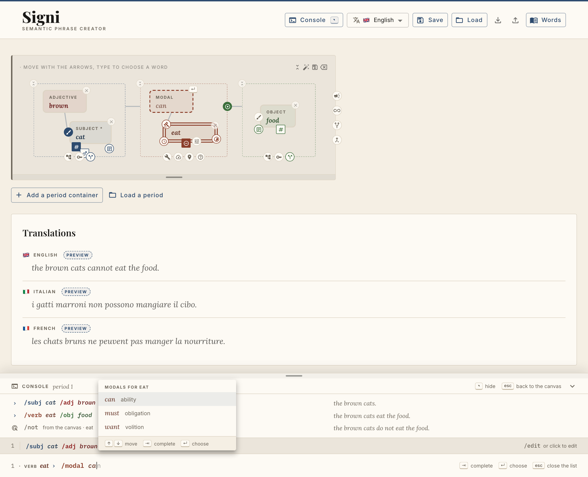
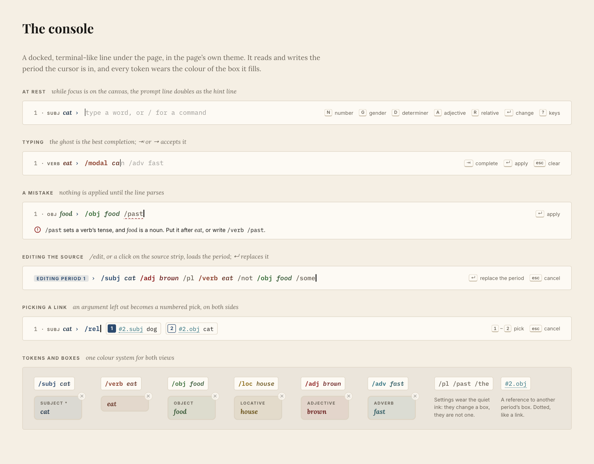
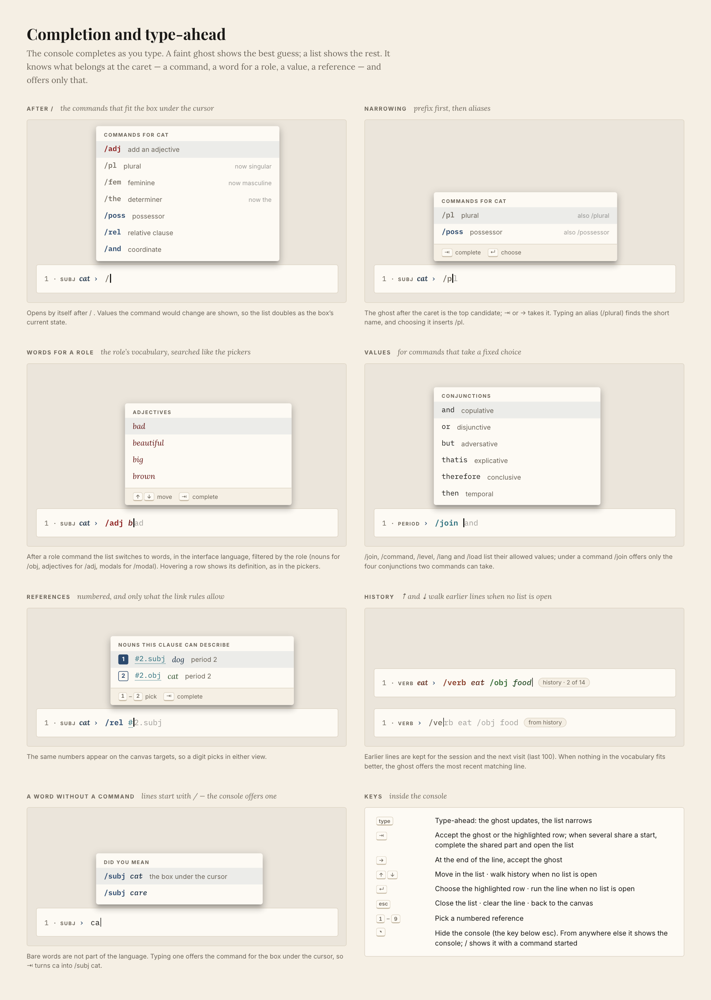
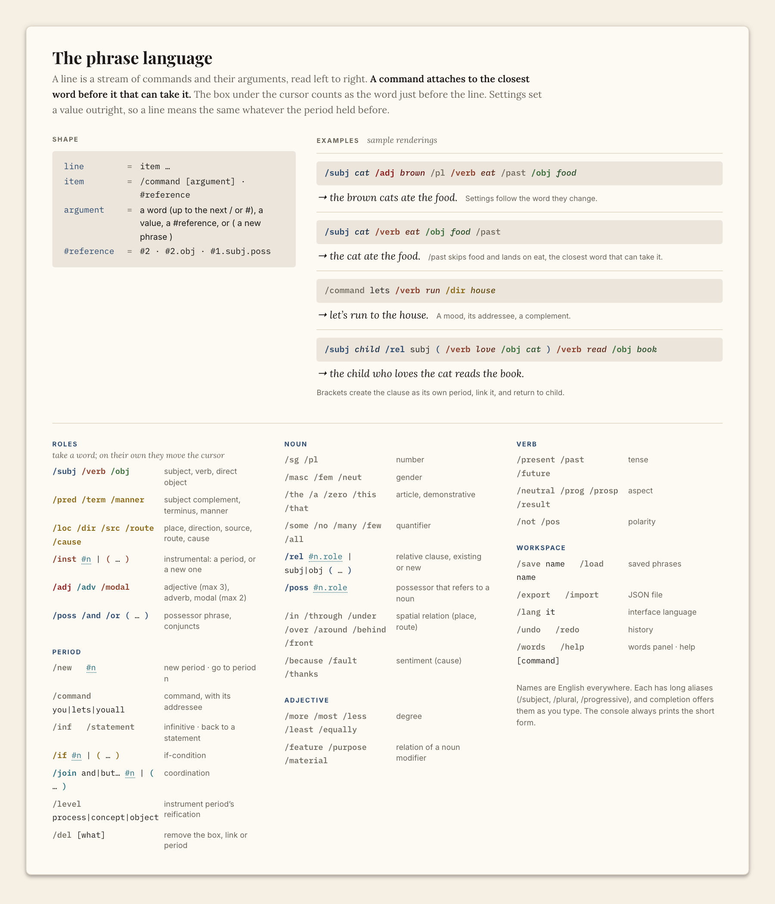
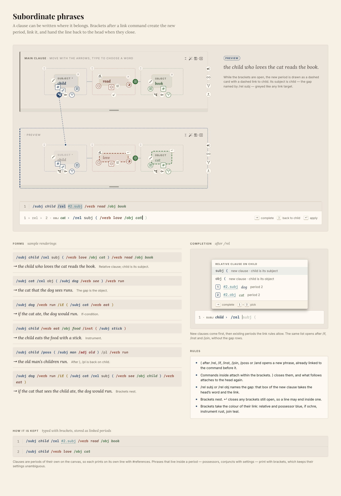
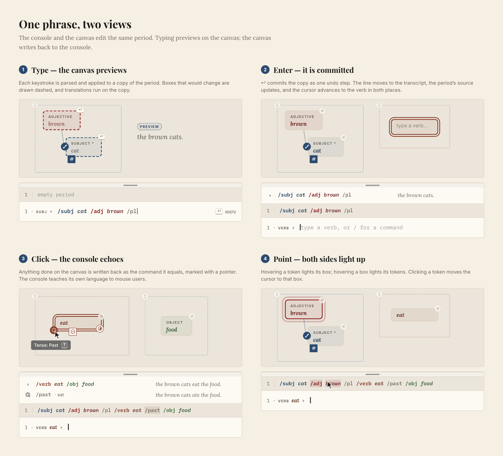

# P02. Phrase console — type the phrase, see it on the canvas, and back

**Feature:** a terminal-like console docked under the page, where a period is built with a small
command language — `/subj cat /adj brown /pl /verb eat /past /obj food` — with type-ahead and
completion at every position. The console and the canvas are **two views of one phrase**: typing
previews on the canvas, and every canvas action is written back to the console as the command it
equals.
**Shape:** a pure text ⇄ selection layer (parse, complete, apply, print) over the existing reducers,
and one console component. No change to the engine, the API or the saved-phrase format.
**Relation to [P01](../P01-keyboard-first-ux/README.md):** P01 keeps the canvas itself fully reachable from
the keyboard (cursor, focus ring, key tips, box letters). The console is the fast path, and it
replaces P01's command palette and hint bar.
**Status:** planning. Direction settled on 2026-09-13 ([Decisions](#decisions)); no open questions.
**Drawings:** [`artwork/`](artwork/) — six images exported from page *Phrase console (P02)* of
the [design canvas](https://claude.ai/code/artifact/7a68e65c-9f8b-44c0-b02c-8e4c4224dc8f), embedded in
the sections they illustrate.

---

## Decisions

Settled on 2026-09-13:

| # | Decision | Consequence in this plan |
|---|---|---|
| 1 | The console follows the **page theme** (paper), not a dark terminal. | Same tokens as the rest of the app; slot colours used exactly as the boxes use them. |
| 2 | **No bare words.** Every line starts with a command (or a `#reference`). | Words appear only as arguments. Typing a word without a command is met by completion, not parsed (§2.4). |
| 3 | **Command names are English** for every interface language. | Long English aliases exist; aliases in the interface language may come later. |
| 4 | The text form is **not a save format** for now. | Saved phrases stay JSON; no `.signi` files until the feature has matured. Multi-line paste still works. |
| 5 | **Type-ahead and command completion** are part of the console, not polish. | §2.4; shipped in phase 2 with the first console. |
| 6 | **<kbd>&#96;</kbd> shows and hides the console.** | §2.1. Matched by key position (the key below <kbd>esc</kbd>), so it works on layouts without a backtick. Once shown, the console stays shown until it is hidden. |

## Why

- **The canvas shows structure; typing is fastest to compose.** Today a word is typed but
  everything around it is clicked. Letter shortcuts (P01) help, but they must be memorised per box
  type and still take one action per control.
- **Commands take arguments.** An adjective is `/adj brown` — not "reveal the adjective box, open its
  picker, type, choose". A whole noun phrase is one line.
- **Discoverable without memorising.** Completion lists what fits at the caret, with current values.
  No modifier chords, so nothing differs between macOS, Windows and Linux, or between keyboard layouts.
- **It is plain text in a text field** — the most accessible input there is.

## 1. How it feels

| Typed in the console | What the canvas does | What the console shows |
|---|---|---|
| <kbd>&#96;</kbd> | The console slides up under the page. | The caret is in the prompt. |
| `/su` <kbd>⇥</kbd> `ca` <kbd>⇥</kbd> | Nothing yet. | `/` opens the command list; `/subj cat` — each <kbd>⇥</kbd> accepts the ghost. |
| ` /adj br` <kbd>⇥</kbd> ` /pl` | *cat* and *brown* appear as dashed preview boxes; translations preview. | The ghost and list follow every keystroke. |
| <kbd>↵</kbd> | The boxes become real; the cursor moves to the Verb. | `› /subj cat /adj brown /pl` — *the brown cats.* |
| `/verb eat /obj food` <kbd>↵</kbd> | Verb and object filled. | *the brown cats eat the food.* |
| *(click the polarity control on eat)* | eat turns negative. | `⌖ /not · eat` — *the brown cats do not eat the food.* |
| `/modal ca` <kbd>⇥</kbd> <kbd>↵</kbd> | A modal box *can*, previewed then committed. | *the brown cats cannot eat the food.* |
| `/subj /rel obj ( /subj dog /verb see )` <kbd>↵</kbd> | A second period appears, already linked to *cats* as a relative clause. | *the brown cats that the dog sees cannot eat the food.* |
| <kbd>↑</kbd> | — | The previous line comes back from history. |
| <kbd>esc</kbd> <kbd>&#96;</kbd> | The page gets its full height back; the cursor is on the canvas again. | esc clears the line; &#96; hides the console. |

(Sentences are sample renderings.)

## 2. The console

### 2.1 Placement and states — *artboard "Console and canvas together"*



Docked to the bottom of the viewport, full page width (stopping at the words panel when it is open),
on the page's paper with the source strip on the canvas colour. The page gains bottom padding equal
to the console's height so nothing hides under it.

- **<kbd>&#96;</kbd> shows and hides it.** From anywhere, <kbd>&#96;</kbd> shows the console and puts the caret
  in its prompt. If the console is shown but focus is elsewhere, <kbd>&#96;</kbd> takes focus instead of
  hiding it (so a keystroke never hides what you meant to type into). If the prompt already has focus,
  <kbd>&#96;</kbd> hides the console and gives focus back to the canvas cursor.
- **<kbd>/</kbd>** outside a text field does what <kbd>&#96;</kbd> does, with `/` already typed and the command
  list open.
- **Shown:** title row, transcript, source strip and prompt. It stays shown when focus goes back to the
  canvas; its prompt line then doubles as P01's hint line, listing the keys of the box under the
  cursor. The grip resizes it. Height and shown/hidden are remembered (`signi:consoleHeight`,
  `signi:consoleOpen`, like `signi:graphHeight`); it is shown on the first visit.
- **Hidden:** nothing is docked and the page gets its full height back. The header's Console button
  carries the <kbd>&#96;</kbd> keycap and toggles it for mouse users.
- **The key is physical.** <kbd>&#96;</kbd> is matched by `event.code === "Backquote"` — the key below
  <kbd>esc</kbd> — not by the character typed, because many layouts have no plain backtick (Italian) or
  make it a dead key (German, French, Spanish). On macOS with ISO keyboards browsers report that key
  as `IntlBackslash`, so both codes are accepted there (to verify on real keyboards in QA). The key is left alone while focus is in any
  other text field (a picker, the save dialog), where it still types its character.

```
╭─ grip ─────────────────────────────────────────────────────────────────────────────────╮
│ ▣ CONSOLE  period 1                                     [`] hide  [esc] back   ⌄      │  title
├────────────────────────────────────────────────────────────────────────────────────────┤
│ ›  /subj cat /adj brown /pl                                   the brown cats.          │  transcript
│ ›  /verb eat /obj food                                        the brown cats eat the food.
│ ⌖  /not   from the canvas · eat                    ┌─────────────────────┐ do not eat…  │
├────────────────────────────────────────────────────│ MODALS FOR EAT      │─────────────┤
│ 1 │ /subj cat /adj brown /pl ▒/verb eat /not▒ /obj  │ can      ability    │  /edit      │  source strip
├────────────────────────────────────────────────────│ must     obligation │─────────────┤
│ 1 · VERB eat ›  /modal ca▏n                         │ want     volition   │  [⇥] [↵]    │  prompt + list
╰────────────────────────────────────────────────────└─────────────────────┘─────────────╯
```

### 2.2 Anatomy — *artboard "The console"*



- **Context chip** `1 · VERB eat ›` — where the next command will attach: the console's equivalent
  of a working directory. It follows the canvas cursor and moves it. Inside brackets it shows the path
  in: `1 › rel › 2 · OBJ cat ›` (§3, Subordinate phrases).
- **Prompt** — syntax-coloured as you type, with the type-ahead ghost after the caret (§2.4).
- **Diagnostics** — a wavy underline and one line saying what is wrong and how to fix it:
  *`/past` sets a verb's tense, and food is a noun. Put it after eat, or write `/verb /past`.*
  The valid part before the error still previews; <kbd>↵</kbd> is refused until the line parses.
- **Transcript** — typed lines (`›`), echoes of canvas actions (pointer glyph), errors; the right
  column is the period's sentence in the interface language after the change.
- **Source strip** — the focused period's canonical text, on the canvas colour. The cursor's box is
  washed; hovering a token lights its box and vice versa; clicking a token moves the cursor.
  `/edit`, or a click on the strip, loads the whole source into the prompt; <kbd>↵</kbd> replaces the period.

### 2.3 Tokens wear their box's colour

| Token | Colour (from `slots.ts`) |
|---|---|
| `/subj` and its word | primary `#2c4a6e` / word `#1a2f46` |
| `/verb`, `/modal` and words | secondary `#8b3e2a` / `#5e2a1c` |
| `/obj` and its word | success `#3a6e3a` / `#294d29` |
| complements (`/loc`, `/dir`, …) | warning `#8b6914` / `#61490e` |
| `/adj` and its word | error `#8b1a1a` / `#611212` |
| `/adv` and its word | info `#2a6e7c` / `#1d4d57` |
| settings (`/pl`, `/past`, `/the`) | text.secondary `#6b6459` |
| references (`#2.obj`) | info, dotted underline |

Type: **IBM Plex Mono** (added to `index.html` next to Lora / Playfair / Inter), words in its italic.

### 2.4 Completion and type-ahead — *artboard "Completion and type-ahead"*



The console completes at every keystroke. Two things show at once:

- **The ghost** — the single best completion, drawn faintly after the caret (`/modal ca▏n`).
- **The list** — every candidate for the token at the caret, in a popover above it, narrowed as you
  type. It opens by itself after `/`, after a role command and its space, after `#`, and after a
  command that takes a value; <kbd>⇥</kbd> opens it anywhere else.

#### What is offered where

| Caret is at… | Candidates | Source |
|---|---|---|
| `/` or `/partial` | Commands valid for the context: a noun gets `/adj /pl /fem /the /poss /rel /and …`, a verb gets `/modal /adv /past /not …`, a period gets `/command /if /join …`; app commands always. Each row shows the current value it would change (*`/pl` plural · now singular*). | `language/commands.ts` filtered by context kind and `when` (the same availability as `Satellite.available`) |
| the argument of a role command (`/adj b`) | Words of that role in the interface language: nouns for `/obj`, adjectives for `/adj`, modals for `/modal`, nouns *and* pronouns for `/subj` and `/cause`. Hovering a row shows its definition, as in the pickers. | `useConcepts(role)` + `useConceptSearch` + `slotCategories` — the pickers' own data and matcher |
| the argument of a value command (`/join `, `/command `, `/level `, `/lang `, `/load `, `/help `) | The allowed values — only the four conjunctions two commands can take when the period is a command; saved-phrase names for `/load`. | `COORD_CONJUNCTION_OPTIONS` / `coordConjunctionOptions`, `ABSTRACTION_LEVELS`, languages, saved phrases |
| after `/rel `, `/if `, `/inst `, `/join and `, `/poss `, `/and ` | New phrases first — `subj (` and `obj (` for `/rel` (*new clause · child is its subject*), `(` for the others — then the existing periods the link rules allow, numbered. | `commands.ts` + `linkRules.ts` |
| inside `( … )` | Everything above, for the new phrase's context; the ghost offers ` )` once the phrase is complete. | the bracket stack from the lexer |
| `#` or `#2.` | Periods, then their nouns — for link commands only the targets the link rules allow, numbered (*1 #2.subj dog*, *2 #2.obj cat*); a digit picks. | `linkRules.ts` (extracted from `useWorkspaceLinks`) |
| a word typed without a command (`ca`) | *Did you mean* — the role command for the box under the cursor: `/subj cat`. The line itself never keeps a bare word. | context + that role's vocabulary |
| an empty prompt, ↑ / ↓ | Earlier lines from history (§ History). | `history.ts` |

#### Ranking

1. exact match → prefix of the canonical name → prefix of an alias (`/plural` finds `/pl`; choosing it
   inserts `/pl`) → word-start → subsequence;
2. then commands used recently in this session;
3. then the order the canvas uses (reading order for references, menu order for values, the
   vocabulary's order for words).

The ghost is the top candidate. If the vocabulary has nothing better, the ghost offers the most
recent history line starting with what was typed.

#### Keys inside the console

| Keys | Action |
|---|---|
| *type* | Type-ahead: the ghost updates and the list narrows |
| <kbd>⇥</kbd> | Accept the ghost or the highlighted row. When several candidates share a start, complete the shared part and open the list. With nothing to complete, open the list. |
| <kbd>→</kbd> at the end of the line | Accept the ghost |
| <kbd>↑</kbd> / <kbd>↓</kbd> | Move in the list · walk history when no list is open |
| <kbd>↵</kbd> | Choose the highlighted row · run the line when no list is open |
| <kbd>1</kbd>–<kbd>9</kbd> | Pick a numbered reference (while a reference list is open) |
| <kbd>esc</kbd> | Close the list · then clear the line · then return to the canvas (the console stays shown) |
| <kbd>&#96;</kbd> | Hide the console; from outside it, show it or take focus (§2.1) |
| <kbd>/</kbd> | From outside the console: show it with a command started |

#### History

- Each line run from the console is kept; canvas echoes are not.
- Stored per browser in `localStorage["signi:consoleHistory"]`, newest first, the last 100, with
  consecutive duplicates collapsed.
- <kbd>↑</kbd> on a prompt with no list open walks back; a tag shows the position (*history · 2 of 14*).
  Editing a recalled line leaves history untouched.

#### How it is built

`language/complete.ts` is pure:

```ts
complete(text: string, caret: number, ctx: ConsoleContext, state: WorkspaceState, vocab: Vocabulary)
  → { replace: [from: number, to: number], candidates: Candidate[], ghost?: string }
```

It reuses the lexer's spans to find the token at the caret and what kind of argument that position
expects, so completion and parsing can never disagree about the grammar. The vocabulary is the
react-query cache the pickers already fill, so completion needs no extra request and runs
synchronously on every keystroke.

---

## 3. The language — *artboard "The phrase language"*



### Shape

```
line        = item …
item        = /command [argument]  ·  #reference
argument    = a word (the text up to the next / or #)  ·  a value  ·  a #reference  ·  ( line )
#reference  = #2  ·  #2.obj  ·  #1.subj.poss
```

### The one rule

> **A command attaches to the closest word before it that can take it.**
> The box under the cursor counts as the word just before the line.

So `/subj cat /adj brown /pl /verb eat /past` gives *brown* and plural to *cat* and past to *eat*;
`/subj cat /verb eat /obj food /past` still lands `/past` on *eat*; and `/past` typed on its own with
the cursor on the verb sets that verb's tense. Settings **set** a value rather than toggling it, so a
line means the same whatever the period held before — which makes preview, replay and paste safe.

### Words

- A word argument runs to the next `/` or `#`, so multi-word labels need no quotes. It is matched
  in the interface language with the pickers' search (`useConceptSearch`), filtered by the role's
  categories (`slotCategories`).
- Concept ids work everywhere (`/subj CAT`).
- Pronouns: `/subj 1st | 2nd | 3rd | one`, with `/pl` and `/fem` as usual. Typed pronoun forms
  (*I, you, she, we, they, one*) are accepted and offered by completion.

### Commands

Names are English for every interface language. The short name is canonical (what the console
prints); each command also has long aliases (`/subject`, `/plural`, `/progressive`) that completion
matches. "Code" is the existing function each one reaches.

**Roles** — take a word; alone they only move the context

| Command | Meaning | Code |
|---|---|---|
| `/subj` `/verb` `/obj` | subject, verb, direct object | `applyConceptSelect` |
| `/pred` `/term` `/manner` | subject complement, terminus, manner | `applyConceptSelect` |
| `/loc` `/dir` `/src` `/route` `/cause` | place, direction, source, route, cause | `applyConceptSelect` |
| `/inst #n` · `/inst ( … )` | instrumental: period *n*, or a new one | instrumental link (`useWorkspaceLinks`) |
| `/adj` | adjective on the closest noun (next of 3); on a noun modifier, its own adjective | `applyConceptSelect` / `setModifierAdjective` |
| `/adv` | adverb of the verb, or of the closest modal | `applyConceptSelect` (`modifier`, `verbModal*Adverb`) |
| `/modal` | modal (next of 2) | `applyConceptSelect` (`verbModal`, `verbModal2`) |
| `/poss` · `/poss ( … )` | possessor phrase — or, with `#n.role`, a possessor that refers to a noun | nested selection / `setPossessorRef` |
| `/and` `/or` · `/and ( … )` | coordinate another phrase | `addConjunct` + conjunction |

**Noun**

| Command | Meaning | Code |
|---|---|---|
| `/sg` `/pl` | number | `setNumber` *(new; `toggleNumber` today)* |
| `/masc` `/fem` `/neut` | gender | `setGender` *(new)* |
| `/the` `/a` `/zero` `/this` `/that` | article, demonstrative | `setDefiniteness` |
| `/some` `/no` `/many` `/few` `/all` | quantifier | `setDefiniteness` |
| `/rel #n.role` · `/rel subj\|obj ( … )` | relative clause on an existing period, or a new one with the head as its subject or object | relative link (+ `addContainer`) |
| `/in` `/through` `/under` `/over` `/around` `/behind` `/front` | spatial relation (locative, route) | `setSpecifier` |
| `/because` `/fault` `/thanks` | sentiment (cause) | `setSentiment` |

**Verb**

| Command | Meaning | Code |
|---|---|---|
| `/present` `/past` `/future` | tense | `setTense` *(new; `cycleTense` today)* |
| `/neutral` `/prog` `/prosp` `/result` | aspect | `setAspect` *(new)* |
| `/not` `/pos` | polarity | `setNegative` *(new)* |

**Adjective**

| Command | Meaning | Code |
|---|---|---|
| `/more` `/most` `/less` `/least` `/equally` | degree | `setDegree` *(new)* |
| `/feature` `/purpose` `/material` | relation of a noun modifier | `setModifierRelation` *(new)* |

**Period**

| Command | Meaning | Code |
|---|---|---|
| `/new` | new period; context on its subject | `addContainer` |
| `#n` | go to period *n* | cursor |
| `/command [you\|lets\|youall] [order\|instruction]` | command mood and addressee | `setImperative` *(new)*, `setImperativePerson`, `setImperativeRegister` |
| `/inf` · `/statement` | infinitive · back to a plain statement | `setInfinitive` *(new)* |
| `/if #n` · `/if ( … )` | if-condition: an existing period, or a new one | conditional link (+ `addContainer`) |
| `/join and\|or\|but\|thatis\|therefore\|then #n` · `… ( … )` | coordination with an existing or a new period | coordinative link (+ `addContainer`) |
| `/level process\|concept\|object` | reification of an instrument period | `instrumental.onLevelChange` |
| `/edit` | load this period's source into the prompt | console |
| `/del [adj 2 \| obj \| rel \| period …]` | remove what the context names | `applyClear`, `removePossessor`, `removeConjunct`, link removal, `removeContainer` |

**Workspace**

| Command | Meaning |
|---|---|
| `/save name` · `/load name` | saved phrases (JSON, as today) |
| `/export` · `/import` | JSON file (as the header buttons) |
| `/lang it` | interface language |
| `/undo` · `/redo` | history (P01 phase 5) |
| `/words` · `/help [command]` | words panel · help |

New grammar features add a command in the same change — e.g. [A01 passive voice](../../A-ready/A01-passive-voice/README.md) would add `/passive` · `/active`.

### Subordinate phrases — *artboard "Subordinate phrases"*



A clause can be written where it belongs. Brackets after a link command create the new phrase,
link it, and hand the line back to the head when they close:

```
/subj child /rel subj ( /verb love /obj cat ) /verb read /obj book
→ the child who loves the cat reads the book.

/subj cat /rel obj ( /subj dog /verb see ) /verb run
→ the cat that the dog sees runs.

/subj dog /verb run /if ( /subj cat /verb eat )
→ if the cat ate, the dog would run.

/subj child /verb eat /obj food /inst ( /subj stick )
→ the child eats the food with a stick.

/subj child /poss ( /subj man /adj old ) /pl /verb run
→ the old man's children run.

/subj dog /verb run /if ( /subj cat /rel subj ( /verb see /obj child ) /verb eat )
→ if the cat that sees the child ate, the dog would run.
```

(Sample renderings.)

- **`(`** after `/rel`, `/if`, `/inst`, `/join`, `/poss` or `/and` opens a new phrase already linked
  to the command before it: a new period for the clause-level links, a nested phrase for possessors
  and conjuncts.
- **Inside**, commands attach within the brackets. **`)`** closes them, and what follows attaches to
  the head again — in the possessor line, `/pl` lands on *child*, not *man*.
- **`/rel subj` or `/rel obj` names the gap:** that box of the new clause takes the head's word and
  becomes the link target, exactly as a pick on the canvas makes it.
- **Brackets nest**, and <kbd>↵</kbd> closes any that are still open, so a line may end inside one.
- **The link rules still apply** (no cycles, one subordinate role per period, mood rules): a bracket
  that would break one is underlined with the rule's message, as for a `#reference`.
- **Colour:** brackets take their link's colour — relative and possessor primary, if warning,
  instrument secondary, join info — the colours of the canvas connectors.
- **Preview:** while a bracket is open, the new period is drawn as a dashed card with a dashed link to
  the head, and translations preview the whole sentence.
- **Existing periods** are still linked with references (`/rel #2.subj`); completion offers both.

### Canonical printing

`print(period)` is deterministic: subject block → verb block (modals, adverb, tense, aspect,
polarity) → object → complements in `COMPLEMENT_RENDER_ORDER` → period relations; within a noun,
word → adjectives → number → gender → determiner → possessor → conjuncts → relative link. Only
non-default values are printed. Clauses are periods of their own, so each prints on its own line and
links print as references (`/rel #2.subj`), never as brackets. Phrases that live inside a period —
possessors, and conjuncts carrying settings — print in brackets (`/poss ( /subj man /adj old )`),
which keeps their settings unambiguous. The printer also returns a span per token →
`{containerId, slotKey}`, which drives highlighting in both directions.

**Invariant:** for every reachable state, `apply(empty, parse(print(state))) ≡ state`.

---

## 4. Keeping the two views in sync — *artboard "One phrase, two views"*



The state stays where it is: `containers` and `links` in `App.tsx`. The console never keeps its own
copy of the phrase; it derives text from state and turns text into state changes.

```
                 parse · resolve · apply (pure)
   prompt text ──────────────────────────────────▶  preview state ──▶ canvas (dashed boxes)
        ▲    ▲                                          │                translations (Preview)
        │    └── complete (pure): ghost + list     ↵ commit
        │                                               ▼
   source strip ◀──── print (pure) ◀─────────────  App state: containers + links
   transcript   ◀──── diff(print before, after) ◀──── canvas clicks
```

1. **Preview (typing).** Every change of the prompt runs `parse → resolve → apply` on the current
   state. The result is handed to the workspace and translations as a *display* state; boxes whose
   value differs from the committed state render in a new `preview` style (dashed, no halo, a
   ↵ tag). Translations for previewed periods are requested debounced (200 ms) and labelled
   *Preview*. A bracketed clause previews as a new dashed period card with a dashed link. Clearing
   the line drops the preview.
2. **Commit (↵ with no list open).** The preview becomes the state — one undo step. The typed line
   goes to the transcript and to history, with the resulting sentence, and the context advances like
   the pickers' auto-advance.
3. **Echo (canvas → console).** After any change that did not come from the console, each period's
   printed tokens before and after are diffed; the difference is written to the transcript with the
   pointer glyph (`⌖ /past · eat`; removals as `/del …`). This needs no change to the canvas
   handlers — it works from state alone.
4. **Cursor.** The canvas cursor (P01) and the console context are one value. A role command or a
   `#n` moves the ring on the canvas without taking focus from the console; clicking a box or a
   token moves both. Hover highlighting uses the printer's spans.

**A click while a line is pending** re-runs its preview and its completion on the new state. Because
settings set values, the line keeps its meaning; if its context disappeared (the box was deleted), it
shows a diagnostic.

---

## 5. Architecture

### New module — `packages/frontend/src/console/`

| File | Role |
|---|---|
| `language/commands.ts` | The catalogue: name, aliases, where it applies, argument kind (word of a role · value · reference), `apply`, `print`, description, current-value label. |
| `language/lex.ts`, `parse.ts` | Tokens with spans and a bracket stack; error recovery so the valid prefix still previews. A bracket becomes a nested op list owned by its link command. |
| `language/resolve.ts` | Words → concepts (vocabulary for the role, interface language, ids); references → `NounAddress` / container ids. |
| `language/complete.ts` | Candidates, ranking and the ghost for a caret position (§2.4). |
| `language/apply.ts` | Pure: ops + `{containers, links}` → new `{containers, links}`, via `phraseReducers` and the extracted link rules; a bracketed clause adds a container and its link in one step. |
| `language/print.ts` | Pure: state → canonical text + token spans. |
| `language/diff.ts` | Echo diffs. |
| `history.ts` | The persisted line history. |
| `PhraseConsole.tsx` | The docked panel: grip, title, transcript, source strip, prompt; shown / hidden state and the <kbd>&#96;</kbd> toggle. |
| `ConsolePrompt.tsx` | A real `<input>` with a highlighted mirror layer behind it (colours and ghost), so native editing, IME and screen readers keep working; `aria-autocomplete="both"` and `aria-activedescendant` for the list. |
| `CompletionList.tsx`, `SourceStrip.tsx`, `Transcript.tsx` | The parts. `CompletionList` reuses `ConceptOption` for word rows. |
| `useConsoleSync.ts` | Preview, commit, echo, cursor and hover mapping. |

The `language/` layer imports no React and is fully unit-testable.

### Changes to existing code

| File | Change |
|---|---|
| [`phraseReducers.ts`](../../../../packages/frontend/src/components/PhraseBuilder/phraseReducers.ts) | Set-value reducers next to today's toggles and cycles: `setNumber`, `setGender`, `setNegative`, `setTense`, `setAspect`, `setDegree`, `setModifierRelation`, `setModifierNumber`, `setImperative`, `setInfinitive`, `setNounConjunction`. The toggles become thin wrappers over them. |
| [`hooks/useWorkspaceLinks.ts`](../../../../packages/frontend/src/components/PhraseBuilder/hooks/useWorkspaceLinks.ts) | Extract the link rules (no cycles, one subordinate role per period, mood rules) into a pure `linkRules.ts`, so `apply.ts` and `complete.ts` accept exactly what a pick accepts. |
| [`App.tsx`](../../../../packages/frontend/src/App.tsx) | Own the console state and the preview; pass the display state to `PhraseWorkspace` and `useTranslations`; render `PhraseConsole`; bottom padding; the header's Console button. |
| [`PhraseWorkspace.tsx`](../../../../packages/frontend/src/components/PhraseBuilder/PhraseWorkspace.tsx), [`PhraseBuilder.tsx`](../../../../packages/frontend/src/components/PhraseBuilder/PhraseBuilder.tsx) | Accept `previewKeys` and `highlightKeys` per container; report and accept cursor moves. |
| [`Boxes.tsx`](../../../../packages/frontend/src/components/PhraseBuilder/Boxes.tsx) | `SlotBox` gains `preview` and hover-`highlight` states. |
| [`ConceptOption.tsx`](../../../../packages/frontend/src/components/PhraseBuilder/ConceptOption.tsx) | Reused as the word row of the completion list. |
| [`TranslationPanel.tsx`](../../../../packages/frontend/src/components/TranslationPanel.tsx) | *Preview* label on previewed rows. |
| [`index.html`](../../../../packages/frontend/index.html) | Add IBM Plex Mono to the Google Fonts link. |
| [`phraseSerialize/`](../../../../packages/frontend/src/components/PhraseBuilder/phraseSerialize/index.ts) | Unchanged — saved phrases stay JSON (decision 4). |
| i18n | Console captions, list titles and messages through the UI-string catalogue. Command names are not translated (decision 3). |

---

## 6. Phases

| Phase | Scope | Done when |
|---|---|---|
| **1 · Language core** | Catalogue for subject, verb, object, adjectives, adverbs, modals, noun and verb settings; lex / parse / resolve / complete / apply / print; set-value reducers. No UI. | The round-trip invariant holds on generated states and on every saved-phrase fixture those commands cover; completion golden tests pass for every position kind. |
| **2 · Console with completion** | Docked console, coloured prompt, **ghost type-ahead and the completion list** (commands, role words, values), history, transcript with sentences, source strip, context chip; ↵ applies; echo of canvas actions. | A period can be built from the console alone without typing any name in full, and clicking on the canvas shows up in the console. |
| **3 · Live preview and cursor** | Preview state, dashed boxes, preview translations, diagnostics, shared cursor, hover highlight both ways, token click, `/edit`. | Typing a line previews on the canvas before ↵; esc leaves the state untouched. |
| **4 · The whole language** | Complements and relations, possessors, conjuncts, moods, periods (`/new`, `#n`), links with references and numbered completion, bracketed subordinate phrases, `/del`, workspace commands, multi-line paste. | Every control on the canvas has a command (coverage test), and a pasted multi-period script rebuilds the workspace. |
| **5 · Polish** | Recency ranking, `/help` pages, pinning, interface-language aliases if wanted. | — |

## 7. Testing

- **Round trip (vitest):** generate states from the slot and value lists (a small hand-rolled
  generator, or `fast-check` as a dev dependency) and assert the invariant; also run it over the
  existing saved-phrase fixtures.
- **Golden tests** per command: parse, apply, print, and the diagnostic for its common misuse.
- **Bracket tests:** each form above creates the right container and link; `)` returns attachment to
  the head; nesting; <kbd>↵</kbd> closes open brackets; a bracket that breaks a link rule is refused;
  the printed result uses references and still round-trips.
- **Completion tests** per position kind (command, role word, value, reference, word without a
  command, history): candidates, order, ghost and replace range for a given text and caret —
  including aliases (`/plural` → `/pl`) and the command-only conjunctions.
- **Coverage test:** every `Satellite` key from `buildSatellites` and every exported reducer is reached
  by at least one command — the guard against the two views drifting apart.
- **Component:** typing and <kbd>⇥</kbd> in `PhraseConsole` produce the ghost, the list, the preview
  and the commit; an external state change produces the echo.
- **End to end (Playwright):** the §1 session typed into the console using <kbd>⇥</kbd> completion,
  asserting the boxes and all seven translations; clicking canvas controls and asserting the source
  strip; pasting a two-period script.

## 8. Risks

| Risk | Mitigation |
|---|---|
| Two editors drift apart | The coverage test and the round-trip invariant; new features add their command in the same change. |
| A word is ambiguous (same label, two concepts) | Role filtering first; if still ambiguous, the list shows both with their glosses and the choice inserts the id-backed word. |
| Completion feels slow on a large vocabulary | Pure and synchronous over the cached vocabulary; the list renders at most 50 rows. |
| English command names in a seven-language interface | Decision 3; completion descriptions are localised, so the list explains each command in the interface language. |
| Japanese input turns `/` into `・` | Accept `・` and `／` as the command prefix. |
| Preview translations cost a request per pause | 200 ms debounce; react-query cancels superseded requests. |
| Small screens | Hidden by default below 600px width. |
| The backtick key differs across layouts and keyboards | Match the physical key (`Backquote`, and `IntlBackslash` on macOS ISO keyboards); never intercept it inside other text fields; the header button toggles too. |

## Open questions

None for now. Showing and hiding with <kbd>&#96;</kbd> settled the last one: the console stays shown until it is hidden.
